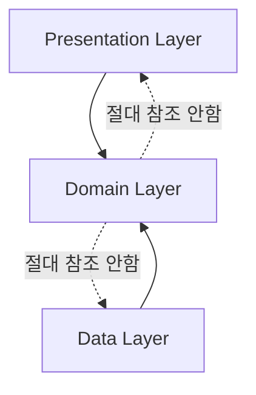
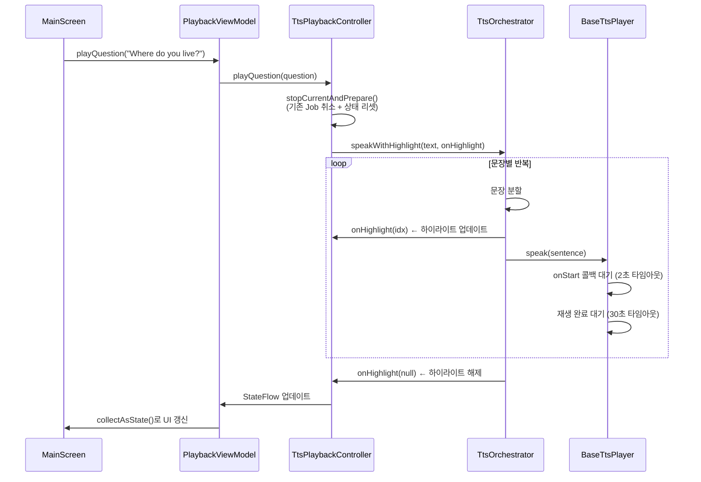
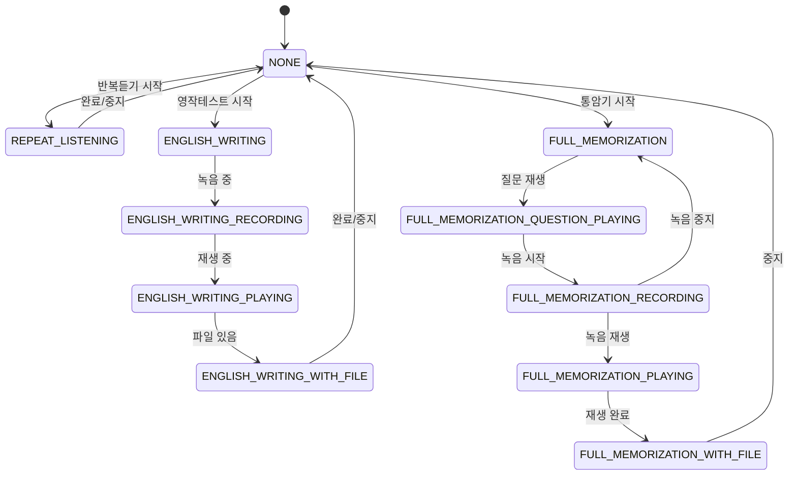

# OPIc Helper — 전체 아키텍처 문서

> 이 문서는 프로젝트를 처음 보는 사람이 전체 구조를 파악할 수 있도록 작성되었습니다.
> 읽기 순서: **이 문서 → 모듈별 아키텍처 문서 → 개선 계획서**

## 추천 읽기 순서

```
1. ARCHITECTURE.md         ← 지금 읽는 중 (전체 개요)
2. ARCHITECTURE_DOMAIN.md  ← 핵심 비즈니스 로직 (가장 먼저 이해해야 함)
3. ARCHITECTURE_DATA.md    ← 실제 구현체 (Domain 인터페이스의 구현)
4. ARCHITECTURE_PRESENTATION.md ← UI와 상태 관리 (사용자가 보는 것)
5. ARCHITECTURE_IMPROVEMENT_PLAN.md ← 구조적 문제와 개선 방향
```

---

## 1. 프로젝트 한 줄 요약

**OPIc Helper** = OPIc 영어 말하기 시험 대비 Android 앱. 질문을 보여주고, TTS로 영어/한국어를 들려주고, 녹음으로 연습하게 만드는 앱.

## 2. 앱이 하는 일 (사용자 관점)

```
┌──────────────────────────────────────────────┐
│                  OPIc Helper                  │
├──────────────────────────────────────────────┤
│                                              │
│  1. 카테고리 선택 (예: "집", "음악", "영화")    │
│  2. 학습 난이도 선택 (AL / IH / IH_RAW / IM)  │
│  3. 암기 모드 선택                            │
│     ├─ 반복듣기: 한국어 듣기 → 영어 듣기 반복    │
│     ├─ 영작테스트: 한국어 듣기 → 녹음 → 병합재생  │
│     └─ 통암기: 질문 듣기 → 답변 녹음 → 재생     │
│  4. 질문/답변 1회 재생 (TTS)                  │
│  5. 설정: 학습 레벨 변경                       │
│                                              │
└──────────────────────────────────────────────┘
```

## 3. 전체 아키텍처 다이어그램

### 3.1 계층 구조

```
┌─────────────────────────────────────────────────────────┐
│                    Presentation Layer                     │
│  ┌──────────────┐ ┌──────────────┐ ┌──────────────────┐ │
│  │ MainScreen    │ │SettingsScreen│ │  AppNavigation   │ │
│  └──────┬───────┘ └──────┬───────┘ └──────────────────┘ │
│         │                │                                │
│  ┌──────┴───────┐ ┌──────┴───────┐ ┌──────────────────┐ │
│  │PlaybackVM    │ │SettingsVM    │ │MemorizationVM    │ │
│  │QaBrowserVM   │ │              │ │                  │ │
│  └──────┬───────┘ └──────┬───────┘ └────────┬─────────┘ │
└─────────┼───────────────┼──────────────────┼────────────┘
          │               │                  │
          ▼               ▼                  ▼
┌─────────────────────────────────────────────────────────┐
│                     Domain Layer                         │
│  ┌──────────────┐ ┌──────────────┐ ┌──────────────────┐ │
│  │ Entities     │ │ UseCases     │ │ Repository IFaces│ │
│  │ QaItem       │ │ RepeatListen │ │ QaDataLoader     │ │
│  │ MemorizeLevel│ │ EngWriting   │ │ UserPrefs        │ │
│  │ UserLevel    │ │ FullMem      │ │ RecordingFile    │ │
│  │              │ │ PlayMerged   │ │ RecordingTime    │ │
│  └──────────────┘ └──────────────┘ │ ProgressPersist  │ │
│  ┌──────────────┐ ┌──────────────┐ │ AudioFile        │ │
│  │ TtsPlayer    │ │ TtsOrchestr. │ └──────────────────┘ │
│  │ AudioPlayer  │ │ TtsPlayback  │                      │
│  │ AudioRecorder│ │ Controller   │ ┌──────────────────┐ │
│  │ RecAudioPlayer│ │             │ │ QaDataManager    │ │
│  └──────────────┘ └──────────────┘ │ (구현체, 주의!)   │ │
│                                    └──────────────────┘ │
└───────────────────────────┬─────────────────────────────┘
                            │ 구현
                            ▼
┌─────────────────────────────────────────────────────────┐
│                      Data Layer                          │
│  ┌──────────────┐ ┌──────────────┐ ┌──────────────────┐ │
│  │ GoogleTts    │ │ SamsungTts   │ │ BaseTtsPlayer    │ │
│  │ Player       │ │ Player       │ │ (공통 로직)       │ │
│  └──────────────┘ └──────────────┘ └──────────────────┘ │
│  ┌──────────────┐ ┌──────────────┐ ┌──────────────────┐ │
│  │ AudioRecImpl │ │ AudioPlayImpl│ │ RecAudioPlayImpl │ │
│  └──────────────┘ └──────────────┘ └──────────────────┘ │
│  ┌──────────────┐ ┌──────────────┐ ┌──────────────────┐ │
│  │ RepeatListen │ │ EngWriting   │ │ RecFileRepo      │ │
│  │ RepoImpl     │ │ RepoImpl     │ │ Impl             │ │
│  └──────────────┘ └──────────────┘ └──────────────────┘ │
│  ┌──────────────┐ ┌──────────────┐ ┌──────────────────┐ │
│  │ LeveledQA    │ │ Progress     │ │ AudioFile        │ │
│  │ DataLoader   │ │ Persist Impl │ │ Manager Impl     │ │
│  └──────────────┘ └──────────────┘ └──────────────────┘ │
│  ┌──────────────┐ ┌──────────────┐                      │
│  │ UserPrefs    │ │ AuthRepo     │ │ RecordingTime     │ │
│  │ Repo         │ │              │ │ Manager Impl      │ │
│  └──────────────┘ └──────────────┘ └──────────────────┘ │
└─────────────────────────────────────────────────────────┘
```

### 3.2 의존성 방향 (Clean Architecture)



**규칙**: Domain은 Data도 Presentation도 모른다. Data가 Domain의 인터페이스를 구현하고, Presentation이 Domain의 UseCase/Repository를 사용한다.

### 3.3 데이터 흐름 (TTS 재생 — 가장 중요한 경로)



## 4. DI (의존성 주입) 구조

### 4.1 Hilt 바인딩 개요

```
┌──────────────────────────────────────────────────────┐
│                    AppModule.kt                       │
│                                                      │
│  @Provides @Singleton                                │
│  ├── Context 제공 (Application)                      │
│  ├── SharedPreferences 3개 (opic/user/auth_prefs)    │
│  ├── QaDataLoader → LeveledQaDataLoader              │
│  ├── QaDataManager                                    │
│  ├── ProgressPersistenceService → ...Impl            │
│  ├── RecordingTimeManager → ...Impl                  │
│  ├── RecordingFileRepository → ...Impl               │
│  ├── RepeatListeningRepository → ...Impl             │
│  ├── EnglishWritingTestRepository → ...Impl          │
│  ├── TtsPlayer @Named("google") → GoogleTtsPlayer    │
│  ├── TtsPlayer @Named("samsung") → SamsungTtsPlayer  │
│  ├── AudioPlayer → AudioPlayerImpl                   │
│  ├── AudioRecorder → AudioRecorderImpl               │
│  ├── RecordingAudioPlayer → ...Impl                  │
│  ├── AudioFileManager → ...Impl                      │
│  ├── UserPreferencesRepository                       │
│  ├── AuthRepository                                   │
│  └── WakeLockManager                                  │
│                                                      │
│  @HiltViewModel                                       │
│  ├── QaBrowserViewModel                               │
│  ├── PlaybackViewModel                                │
│  ├── MemorizationViewModel                            │
│  └── SettingsViewModel                                │
└──────────────────────────────────────────────────────┘
```

### 4.2 주의: 이중 등록

7개 클래스가 `@Inject constructor`와 `@Provides` 양쪽에 등록되어 있습니다. Hilt는 `@Provides`를 우선 사용하므로 `@Inject constructor`의 `@Singleton`은 무시됩니다:

| 클래스 | @Inject constructor | @Provides in AppModule |
|--------|-------------------|----------------------|
| QaDataManager | O | O |
| ProgressPersistenceServiceImpl | O | O |
| RecordingTimeManagerImpl | O | O |
| RecordingFileRepositoryImpl | O | O |
| RepeatListeningRepositoryImpl | O | O |
| EnglishWritingTestRepositoryImpl | O | O |
| WakeLockManager | O | O |

## 5. 암기 테스트 모드 상태 머신

MemorizationViewModel의 `CurrentMode`는 암기 테스트의 현재 상태를 나타냅니다:



## 6. 데이터 저장소 맵

```
┌──────────────┐   ┌──────────────┐   ┌──────────────┐
│  opic_prefs  │   │  user_prefs  │   │  auth_prefs  │
│              │   │              │   │              │
│ last_category│   │ user_level   │   │ is_logged_in │
│ last_index   │   │ english_tts  │   │ user_name    │
│ app_exit_    │   │   _rate      │   │ user_email   │
│   state      │   │ last_memorize│   │ user_id      │
│ category_    │   │   _level     │   │ login_type   │
│   progress_* │   │              │   │              │
└──────────────┘   └──────────────┘   └──────────────┘

┌──────────────┐   ┌──────────────┐
│recording_times│   │  파일 시스템  │
│              │   │              │
│ recording_   │   │ recordings/  │
│   times_     │   │   통암기_*.m4a│
│   {cat}_{idx}│   │ merged/      │
│              │   │   영작테스트_  │
│              │   │   *.m4a      │
└──────────────┘   └──────────────┘
```

## 7. 화면 구성

```
┌─────────────────────────────────┐
│         AppTitle (그라디언트)     │
│         [AL]            [⚙️]    │
├────────────────┬────────────────┤
│ 카테고리 선택   │ 암기 모드 선택  │
│ [집      ▼]   │ [반복듣기 ▼]   │
├────────────────┴────────────────┤
│                                 │
│  ┌─── Question Card ──────────┐ │
│  │ "Where do you live?"       │ │
│  │ 1 / 15     집             │ │
│  └───────────────────────────┘ │
│                                 │
│  [▶ 질문 재생]  [▶ 답변 녹음]   │
│                                 │
│  ┌─── Answer Card ───────────┐ │
│  │ "I live in an apartment..."│ │
│  │  (하이라이트 진행 중)       │ │
│  └───────────────────────────┘ │
│                                 │
│  [▶ 답변 재생]  [모드별 버튼]   │
│                                 │
│     [◀ 이전]    [다음 ▶]        │
└─────────────────────────────────┘
```

## 8. 핵심 용어 사전

| 용어 | 설명 |
|------|------|
| **QaItem** | 하나의 질문-답변 세트. 질문(영/한), 답변(레벨별 영/한), 어휘/문법/팁 포함 |
| **Category** | 학습 주제. 예: "집", "음악", "영화". JSON의 `title` 필드에서 자동 생성 |
| **MemorizeLevel** | 암기 모드 종류: 반복듣기, 영작테스트, 통암기 |
| **UserLevel** | OPIc 시험 레벨: AL, IH, IH_RAW, IM. 답변 내용이 레벨별로 다름 |
| **CurrentMode** | MemorizationViewModel 내부 상태머신. 12개 값으로 암기 테스트의 현재 단계 표현 |
| **TtsOrchestrator** | 한국어/영어를 자동 감지해서 적절한 TTS 엔진으로 라우팅 |
| **TtsPlaybackController** | 재생 상태(재생 중, 하이라이트 인덱스 등)를 7개 StateFlow로 관리 |
| **HighlightIndex** | 현재 재생 중인 문장의 인덱스. UI에서 해당 문장을 크게/색상 강조 |
| **MergedFile** | 영작테스트에서 여러 녹음을 하나로 합친 파일 |
| **ProgressPersistence** | 진행상황을 SharedPreferences에 저장. 앱 재시작 시 이어서 학습 가능 |
