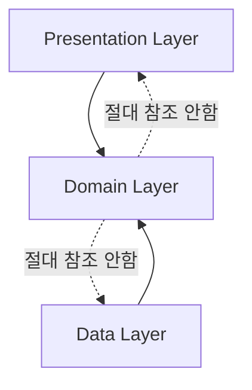
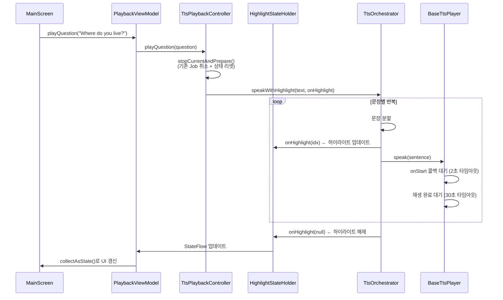
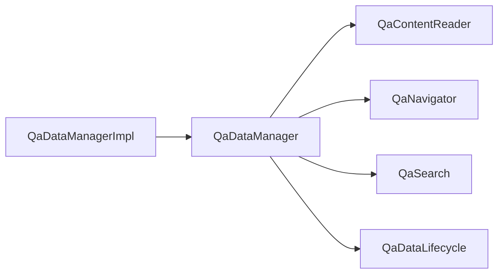
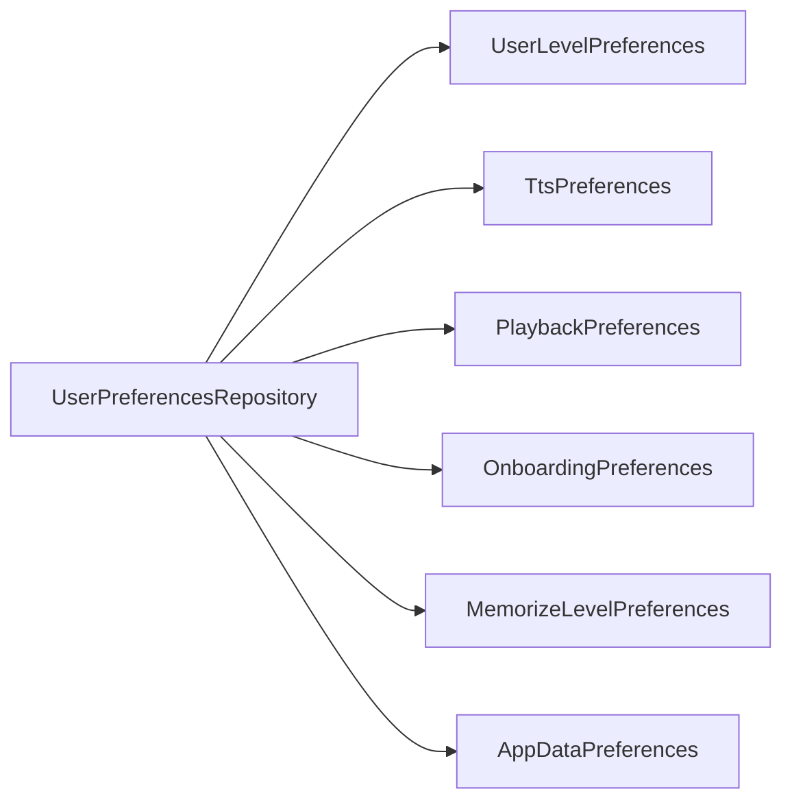
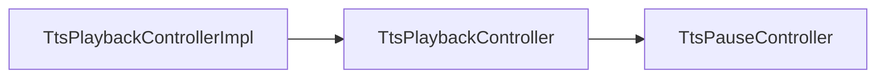
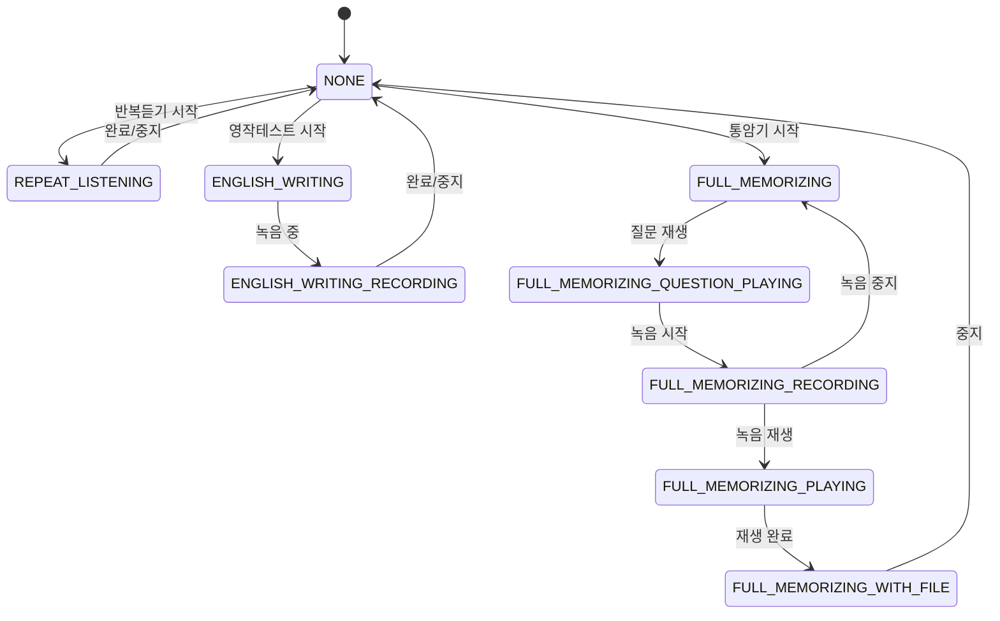
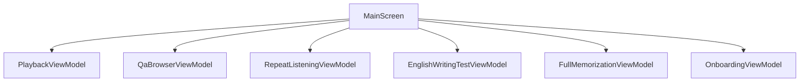
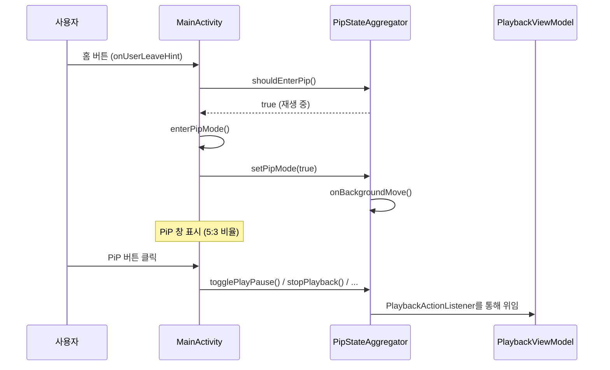

# OPIc Helper — 전체 아키텍처 문서

> 이 문서는 프로젝트를 처음 보는 사람이 전체 구조를 파악할 수 있도록 작성되었습니다.
> 읽기 순서: **이 문서 → 모듈별 아키텍처 문서 → 개선 계획서**

## 추천 읽기 순서

```
1. ARCHITECTURE.md         ← 지금 읽는 중 (전체 개요)
2. ARCHITECTURE_DOMAIN.md  ← 핵심 비즈니스 로직 (가장 먼저 이해해야 함)
3. ARCHITECTURE_DATA.md    ← 실제 구현체 (Domain 인터페이스의 구현)
4. ARCHITECTURE_PRESENTATION.md ← UI와 상태 관리 (사용자가 보는 것)
5. ARCHITECTURE_IMPROVEMENT_PLAN.md ← 구조적 문제와 개선 방향
```

---

## 1. 프로젝트 한 줄 요약

**OPIc Helper** = OPIc 영어 말하기 시험 대비 Android 앱. 질문을 보여주고, TTS로 영어/한국어를 들려주고, 녹음으로 연습하게 만드는 앱.

## 2. 앱이 하는 일 (사용자 관점)

```
┌──────────────────────────────────────────────┐
│                  OPIc Helper                  │
├──────────────────────────────────────────────┤
│                                              │
│  1. 카테고리 선택 (예: "집", "음악", "영화")    │
│  2. 학습 난이도 선택 (AL / IH / IH_RAW / IM)  │
│  3. 암기 모드 선택                            │
│     ├─ 반복듣기: 한국어 듣기 → 영어 듣기 반복    │
│     ├─ 영작테스트: 한국어 듣기 → 녹음 → 병합재생  │
│     └─ 통암기: 질문 듣기 → 답변 녹음 → 재생     │
│  4. 질문/답변 1회 재생 (TTS)                  │
│  5. 설정: 학습 레벨 변경                       │
│  6. 학습 통계: 일별 학습 세션, 최장 연속 기록    │
│                                              │
└──────────────────────────────────────────────┘
```

## 3. 전체 아키텍처 다이어그램

### 3.1 계층 구조

```
┌─────────────────────────────────────────────────────────┐
│                    Presentation Layer                     │
│  ┌──────────────┐ ┌──────────────┐ ┌──────────────────┐  │
│  │ MainScreen   │ │SettingsScreen│ │ StatisticsScreen │  │
│  └──────┬───────┘ └──────┬───────┘ └────────┬─────────┘  │
│         │                │                   │            │
│  ┌──────┴───────────────┐ │  ┌──────────────┴─────────┐  │
│  │ PlaybackVM            │ │  │ StatisticsVM           │  │
│  │ QaBrowserVM           │ │  └────────────────────────┘  │
│  │ RepeatListeningVM     │ │  ┌──────────────────────┐   │
│  │ EnglishWritingTestVM  │ └──┤ SettingsVM           │   │
│  │ FullMemorizationVM    │    └──────────────────────┘   │
│  │ OnboardingVM          │    ┌──────────────────────┐   │
│  └──────────┬────────────┘    │ EditScriptVM         │   │
│             │                └──────────┬───────────┘   │
└─────────────┼───────────────────────────┼───────────────┘
              │                           │
              ▼                           ▼
┌─────────────────────────────────────────────────────────┐
│                     Domain Layer                         │
│  ┌──────────────┐ ┌──────────────┐ ┌──────────────────┐ │
│  │ Entities     │ │ UseCases     │ │ Repository IFaces│ │
│  │ QaItem       │ │ PlayMerged   │ │ QaDataLoader     │ │
│  │ MemorizeLevel│ │ FullMem      │ │ UserPrefs        │ │
│  │ UserLevel    │ │ ProgressClean│ │ RecordingFile    │ │
│  │ CurrentMode  │ │ RecordStudy  │ │ RecordingTime    │ │
│  │ ModeGroup    │ │ Session      │ │ ProgressPersist  │ │
│  │ ScriptProgress│ │             │ │ AudioFile        │ │
│  └──────────────┘ └──────────────┘ │ StudySession     │ │
│  ┌──────────────┐ ┌──────────────┐ │ ScriptEdit       │ │
│  │ TtsPlayer    │ │ TtsOrchestr. │ │ DataSeeder       │ │
│  │ AudioPlayer  │ │ TtsPlayback  │ └──────────────────┘ │
│  │ AudioRecorder│ │ Controller   │ ┌──────────────────┐ │
│  │ RecAudioPlayer│ │TtsPauseCtrl  │ │ QaDataManager    │ │
│  │ HighlightState│ │PipStateAggr.│ │ (복합 인터페이스)  │ │
│  └──────────────┘ └──────────────┘ └──────────────────┘ │
│  ┌──────────────┐ ┌──────────────┐                       │
│  │ Memorization │ │ WakeLock     │                       │
│  │ ModeCoord.   │ │ Controller   │                       │
│  └──────────────┘ └──────────────┘                       │
└───────────────────────────┬─────────────────────────────┘
                            │ 구현
                            ▼
┌─────────────────────────────────────────────────────────┐
│                      Data Layer                          │
│  ┌──────────────┐ ┌──────────────┐ ┌──────────────────┐ │
│  │ GoogleTts    │ │ SamsungTts   │ │ BaseTtsPlayer    │ │
│  │ Player       │ │ Player       │ │ (공통 로직)       │ │
│  └──────────────┘ └──────────────┘ └──────────────────┘ │
│  ┌──────────────┐ ┌──────────────┐ ┌──────────────────┐ │
│  │ AudioRecImpl │ │ AudioPlayImpl│ │ RecAudioPlayImpl │ │
│  └──────────────┘ └──────────────┘ └──────────────────┘ │
│  ┌──────────────┐ ┌──────────────┐ ┌──────────────────┐ │
│  │ RepeatListen │ │ EngWriting   │ │ RecFileRepo      │ │
│  │ RepoImpl     │ │ RepoImpl     │ │ Impl             │ │
│  └──────────────┘ └──────────────┘ └──────────────────┘ │
│  ┌──────────────┐ ┌──────────────┐ ┌──────────────────┐ │
│  │ RoomQaData  │ │ LeveledQA    │ │ AssetSeeder      │ │
│  │ Loader      │ │ DataLoader   │ │                  │ │
│  └──────────────┘ └──────────────┘ └──────────────────┘ │
│  ┌──────────────┐ ┌──────────────┐ ┌──────────────────┐ │
│  │ Progress     │ │ AudioFile    │ │ UserPrefs        │ │
│  │ Persist Impl │ │ Manager Impl │ │ Repo             │ │
│  └──────────────┘ └──────────────┘ └──────────────────┘ │
│  ┌──────────────┐ ┌──────────────┐ ┌──────────────────┐ │
│  │ RecordingTime│ │ ScriptEdit   │ │ StudySession     │ │
│  │ Manager Impl │ │ RepoImpl     │ │ RepoImpl         │ │
│  └──────────────┘ └──────────────┘ └──────────────────┘ │
│  ┌──────────────┐                                       │
│  │ AndroidLogger│ │ WakeLockCtrl │ TtsServiceCtrlImpl  │ │
│  └──────────────┘ └──────────────┘ └──────────────────┘ │
│  ┌──────────────┐ ┌──────────────┐ ┌──────────────────┐ │
│  │ AppDatabase  │ │ QaItemDao    │ │ QaItemEntityMapper│ │
│  └──────────────┘ └──────────────┘ └──────────────────┘ │
└─────────────────────────────────────────────────────────┘
```

### 3.2 의존성 방향 (Clean Architecture)



**규칙**: Domain은 Data도 Presentation도 모른다. Data가 Domain의 인터페이스를 구현하고, Presentation이 Domain의 UseCase/Repository를 사용한다.

### 3.3 데이터 흐름 (TTS 재생 — 가장 중요한 경로)



## 4. DI (의존성 주입) 구조

DI 바인딩 전체 목록: [di/CLAUDE.md](../../app/src/main/java/com/na982/opichelper/di/CLAUDE.md)

### 4.1 QaDataManager ISP 분리 구조

QaDataManager은 4개 하위 인터페이스로 분리되어 있으며, AppModule에서 QaDataManagerImpl 인스턴스를 각 인터페이스에 위임 바인딩합니다:



의존성이 필요한 클래스는 전체 QaDataManager가 아닌 필요한 하위 인터페이스만 주입받아야 합니다.

### 4.2 UserPreferencesRepository ISP 분리 구조

UserPreferencesRepository도 6개 하위 인터페이스로 분리되어 있으며, AppModule에서 UserPreferencesRepository 인스턴스를 각 인터페이스에 위임 바인딩합니다:



### 4.3 TtsPlaybackController ISP 분리 구조

TtsPlaybackController는 TtsPauseController 하위 인터페이스를 포함하는 복합 인터페이스입니다:



## 5. 암기 테스트 모드 상태 머신

`CurrentMode`는 암기 테스트의 현재 상태를 나타내는 9개 값의 enum입니다:



### 5.1 ModeGroup (모드 그룹)

`ModeGroup`은 CurrentMode를 4개 그룹으로 분류하는 enum입니다:

| ModeGroup | 포함된 CurrentMode 값 |
|-----------|----------------------|
| NONE | NONE |
| REPEAT_LISTENING | REPEAT_LISTENING |
| ENGLISH_WRITING | ENGLISH_WRITING, ENGLISH_WRITING_RECORDING |
| FULL_MEMORIZING | FULL_MEMORIZING, FULL_MEMORIZING_QUESTION_PLAYING, FULL_MEMORIZING_RECORDING, FULL_MEMORIZING_PLAYING, FULL_MEMORIZING_WITH_FILE |

ModeGroup은 MemorizationModeCoordinator가 3개 모드의 상호 배제를 관리하고, MainActivity가 ModeGroup→ViewModel 매핑으로 MemorizationController를 구성하는 데 사용됩니다.

## 6. 데이터 저장소 맵

```
┌──────────────┐   ┌──────────────┐   ┌──────────────┐
│  opic_prefs  │   │  user_prefs  │   │recording_times│
│              │   │              │   │              │
│ last_category│   │ user_level   │   │ recording_   │
│ last_script_ │   │ english_tts  │   │   times_     │
│   index      │   │   _rate      │   │   {cat}_{idx}│
│ last_sentence│   │ last_memorize│   │              │
│   _index     │   │   _level     │   └──────────────┘
│ category_    │   │ repeat_      │
│   progress_* │   │   listening_ │
│              │   │   count      │
└──────────────┘   │ answer_play_ │
                   │   count      │
┌──────────────┐   │ auto_advance │
│study_sessions│   │ onboarding_  │
│              │   │   completed  │
│ daily_{date} │   │ pip_guide_   │
│ longest_streak│   │   completed  │
│              │   │ seed_version │
└──────────────┘   └──────────────┘

┌──────────────┐
│  파일 시스템  │
│              │
│ recordings/  │
│   통암기_*.m4a│
│ merged/      │
│   영작테스트_  │
│   *.m4a      │
└──────────────┘
```

### 6.1 SharedPreferences 키 상세

| 파일 | 키 | 타입 | 설명 |
|------|-----|------|------|
| opic_prefs | last_category | String | 마지막 선택 카테고리 |
| opic_prefs | last_script_index | Int | 마지막 스크립트 인덱스 |
| opic_prefs | last_sentence_index | Int | 마지막 문장 인덱스 |
| opic_prefs | category_progress_* | String | 카테고리별 진행상황 (접두어) |
| user_prefs | user_level | String | OPIc 시험 레벨 (AL/IH/IH_RAW/IM) |
| user_prefs | english_tts_rate | Float | 영어 TTS 속도 |
| user_prefs | last_memorize_level | String | 마지막 암기 모드 |
| user_prefs | repeat_listening_count | Int | 반복듣기 횟수 |
| user_prefs | answer_play_count | Int | 답변 재생 횟수 |
| user_prefs | auto_advance | Boolean | 자동 다음 항목 이동 |
| user_prefs | onboarding_completed | Boolean | 온보딩 완료 여부 |
| user_prefs | pip_guide_completed | Boolean | PiP 가이드 완료 여부 |
| user_prefs | seed_version | Int | 데이터 시드 버전 |
| recording_times | recording_times_{cat}_{idx} | Long | 녹음 시간 (접두어) |
| study_sessions | daily_{date} | String | 일별 학습 세션 데이터 (접두어) |
| study_sessions | longest_streak | Int | 최장 연속 학습 일수 |

## 7. 화면 구성

### 7.1 네비게이션

네비게이션 상세: [ARCHITECTURE_PRESENTATION.md 섹션 9](ARCHITECTURE_PRESENTATION.md)

### 7.2 MainScreen 레이아웃

```
┌─────────────────────────────────┐
│         AppTitle (그라디언트)     │
│         [AL]            [⚙️]    │
├────────────────┬────────────────┤
│ 카테고리 선택   │ 암기 모드 선택  │
│ [집      ▼]   │ [반복듣기 ▼]   │
├────────────────┴────────────────┤
│                                 │
│  ┌─── Question Card ──────────┐ │
│  │ "Where do you live?"       │ │
│  │ 1 / 15     집             │ │
│  └───────────────────────────┘ │
│                                 │
│  [▶ 질문 재생]  [▶ 답변 녹음]   │
│                                 │
│  ┌─── Answer Card ───────────┐ │
│  │ "I live in an apartment..."│ │
│  │  (하이라이트 진행 중)       │ │
│  └───────────────────────────┘ │
│                                 │
│  [▶ 답변 재생]  [모드별 버튼]   │
│                                 │
│     [◀ 이전]    [다음 ▶]        │
└─────────────────────────────────┘
```

### 7.3 MainScreen ViewModel 구성

MainScreen은 6개 ViewModel을 사용합니다:



MainActivity에서 ModeGroup→ViewModel 매핑으로 MemorizationController를 구성합니다:

| ModeGroup | ViewModel |
|-----------|-----------|
| REPEAT_LISTENING | RepeatListeningViewModel |
| ENGLISH_WRITING | EnglishWritingTestViewModel |
| FULL_MEMORIZING | FullMemorizationViewModel |

### 7.4 PiP 오버레이 모드

앱이 백그라운드로 이동할 때 재생 중이면 PiP 모드로 전환됩니다:



PiP 원격 제어 액션 5개: 재생/일시정지, 정지, 반복, 다음, 문장 반복

## 8. 앱 진입점

| 진입점 | 역할 |
|--------|------|
| `OPicHelperApplication.kt` | `@HiltAndroidApp`. 최소한의 Application 클래스. 커스텀 로직 없음 |
| `SplashActivity.kt` | 런처 Activity. 2초 스플래시 후 MainActivity 이동 |
| `MainActivity.kt` | `@AndroidEntryPoint`. PiP 관리, WakeLock, 세션 추적, 권한, 리소스 정리 |

## 9. 핵심 용어 사전

| 용어 | 설명 |
|------|------|
| **QaItem** | 하나의 질문-답변 세트. 질문(영/한), 답변(레벨별 영/한), 어휘/문법/팁 포함 |
| **Category** | 학습 주제. 예: "집", "음악", "영화". JSON의 `title` 필드에서 자동 생성 |
| **MemorizeLevel** | 암기 모드 종류: 반복듣기, 영작테스트, 통암기 |
| **UserLevel** | OPIc 시험 레벨: AL, IH, IH_RAW, IM. 답변 내용이 레벨별로 다름 |
| **CurrentMode** | 암기 테스트 상태머신. 9개 값으로 현재 단계 표현 |
| **ModeGroup** | CurrentMode를 4개 그룹(NONE, REPEAT_LISTENING, ENGLISH_WRITING, FULL_MEMORIZING)으로 분류 |
| **TtsOrchestrator** | 한국어/영어를 자동 감지해서 적절한 TTS 엔진으로 라우팅 |
| **TtsPlaybackController** | 재생 상태 관리 컨트롤러. TtsPauseController 하위 인터페이스 포함 |
| **HighlightStateHolder** | 하이라이트 상태(질문/답변/녹음)를 4개 StateFlow로 관리 |
| **PipStateAggregator** | PiP 상태 집계. PlaybackActionListener를 통해 재생 제어 위임 |
| **HighlightIndex** | 현재 재생 중인 문장의 인덱스. UI에서 해당 문장을 크게/색상 강조 |
| **MergedFile** | 영작테스트에서 여러 녹음을 하나로 합친 파일 |
| **ProgressPersistence** | 진행상황을 SharedPreferences에 저장. 앱 재시작 시 이어서 학습 가능 |
| **MemorizationModeCoordinator** | 3개 암기 모드의 상호 배제를 관리하는 @Singleton 코디네이터 |
