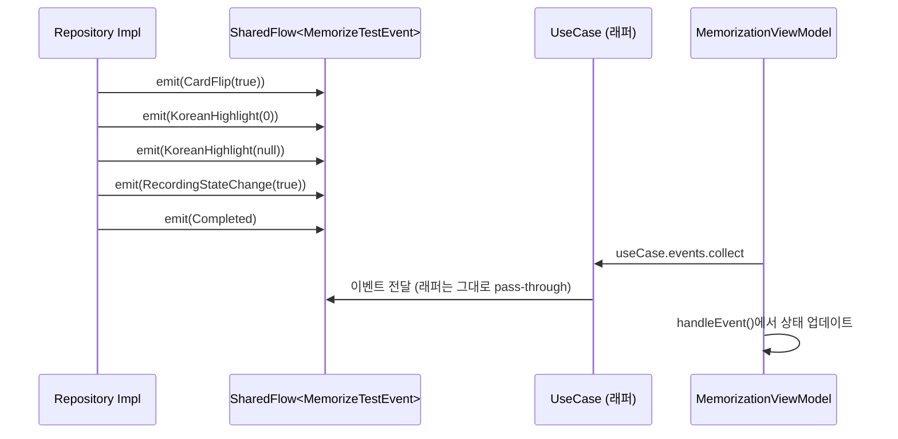

# Data 계층 아키텍처 상세

> Domain 인터페이스의 실제 구현. Android 프레임워크와 직접 통신.

## 1. 계층 역할 한 줄 요약

**Data = 앱의 손과 발**. Domain이 "이렇게 해라"라고 정의한 것을 Android API로 실제로 실행.

## 2. 패키지 구조

```
data/
├── audio/              ← TTS & 오디오 하드웨어 구현체
│   ├── BaseTtsPlayer.kt         🧠 TTS 공통 로직 (speak 보장 메커니즘)
│   ├── GoogleTtsPlayer.kt       영어 TTS (Locale.US)
│   ├── SamsungTtsPlayer.kt      한국어 TTS (Locale.KOREAN)
│   ├── AudioRecorderImpl.kt     MediaRecorder 기반 녹음
│   ├── AudioPlayerImpl.kt       MediaPlayer 기반 재생
│   └── RecordingAudioPlayerImpl.kt 녹음 파일 재생 전용
└── repository/         ← Repository 인터페이스 구현체
    ├── LeveledQaDataLoader.kt   JSON → QaItem 파싱
    ├── ProgressPersistenceServiceImpl.kt SharedPreferences 영속화
    ├── UserPreferencesRepository.kt 사용자 설정 관리
    ├── AuthRepository.kt        로그인 상태 관리 (Domain 인터페이스 없음)
    ├── RecordingFileRepositoryImpl.kt 녹음 파일 CRUD + 재생
    ├── RecordingTimeManagerImpl.kt 문장별 녹음 시간 관리
    ├── RepeatListeningRepositoryImpl.kt 반복듣기 실행 로직
    ├── EnglishWritingTestRepositoryImpl.kt 영작테스트 실행 로직
    └── AudioFileManagerImpl.kt  오디오 파일 병합/관리
```

## 3. TTS 재생 보장 메커니즘 (BaseTtsPlayer)

TTS 엔진은 불안정해서 그냥 `speak()`만 부르면 안 됩니다. BaseTtsPlayer는 4단계 보장 메커니즘을 사용:

```
speak() 호출
  │
  ▼
┌──────────────────────────────────────┐
│ 1단계: isSpeaking 폴링               │
│    stop() 후 TTS 엔진이 정지할 때까지  │
│    50ms 간격으로 최대 20회 확인        │
│    (최대 1초 대기)                    │
├──────────────────────────────────────┤
│ 2단계: speak() 반환값 검사            │
│    ERROR 반환 시 즉시 실패 처리        │
├──────────────────────────────────────┤
│ 3단계: onStart 콜백 대기              │
│    실제 재생이 시작되었는지 확인        │
│    (2초 타임아웃, 초과 시 실패)        │
├──────────────────────────────────────┤
│ 4단계: 재생 완료 대기                 │
│    completionDeferred.await()        │
│    (30초 안전 타임아웃)               │
└──────────────────────────────────────┘
  │
  ▼
speak() 반환 (재생 완료 후)
```

**⚠️ 알려진 문제**: 여러 코루틴에서 동시에 speak()를 호출하면 `UtteranceProgressListener`가 덮어씌워짐. 현재는 TtsPlaybackController의 Job 취소로 보호됨.

## 4. 오디오 파일 병합 전략 (AudioFileManagerImpl)

```
병합 요청
  │
  ▼
파일이 1개인가? ──예──→ 파일 복사만
  │
  아니오
  ▼
┌──────────────────────────────────────────────┐
│ 전략 1: mergeWithMediaCodec                   │
│ MediaExtractor + MediaMuxer                   │
│ 가장 안정적. 성공 시 여기서 종료               │
├──────────────────────────────────────────────┤
│ 전략 2: mergeWithHeaderAnalysis (fallback)    │
│ 첫 번째 파일은 그대로, 나머지는 1024바이트    │
│ 헤더 스킵 후 연결. ⚠️ 불안정 (고정 헤더 크기) │
├──────────────────────────────────────────────┤
│ 전략 3: 파일 연결 (최종 fallback)             │
│ 단순 바이트 복사. 가장 불안정하지만 최소 작동  │
└──────────────────────────────────────────────┘
```

**주의**: `mergeAndSaveAudioFiles()`는 3단계 폴백을 사용하지만, `mergeAudioFiles()`는 MediaCodec만 시도 (폴백 없음).

## 5. SharedFlow 이벤트 패턴

반복듣기와 영작테스트는 UI 콜백 대신 SharedFlow로 이벤트를 발행합니다:



## 6. SharedPreferences 분포

```
┌─────────────────────────────────────────────────────┐
│ opic_prefs (ProgressPersistenceServiceImpl)         │
│   last_category: String     ← 마지막 본 카테고리     │
│   last_index: Int           ← 마지막 본 인덱스       │
│   app_exit_state: String    ← 앱 종료 상태           │
│   category_progress_*: String ← 카테고리별 진행상황  │
├─────────────────────────────────────────────────────┤
│ user_prefs (UserPreferencesRepository)              │
│   user_level: String        ← "AL", "IH" 등         │
│   english_tts_rate: Float   ← 영어 TTS 속도          │
│   last_memorize_level: String ← 마지막 암기 모드     │
├─────────────────────────────────────────────────────┤
│ auth_prefs (AuthRepository)                         │
│   is_logged_in: Boolean                              │
│   user_name: String                                  │
│   user_email: String?                                │
│   user_id: String?                                   │
│   login_type: String       ← "guest" 등              │
├─────────────────────────────────────────────────────┤
│ recording_times (RecordingTimeManagerImpl)           │
│   recording_times_{cat}_{idx}: String (Gson JSON)   │
│   ← 문장별 녹음 시간 List<Long>                      │
└─────────────────────────────────────────────────────┘
```

## 7. ⚠️ 알려진 구조적 문제

| 문제 | 파일 | 설명 |
|------|------|------|
| QaDataManager 직접 참조 | EnglishWritingTestRepoImpl | Data가 Domain 구현체를 직접 import |
| 동기화 없는 mutable 상태 | RecordingFileRepositoryImpl | currentRecordingPath가 여러 코루틴에서 접근 |
| delay()로 재생 완료 판단 | RecordingFileRepositoryImpl | MediaPlayer의 OnCompletionListener 대신 delay 사용 |
| Log.d 잔존 | RecordingFileRepositoryImpl 등 | 디버그 로그가 운영 코드에 남아있음 |
| AuthRepository 인터페이스 없음 | AuthRepository | Domain 계층에 추상화 없이 구현체만 존재 |
