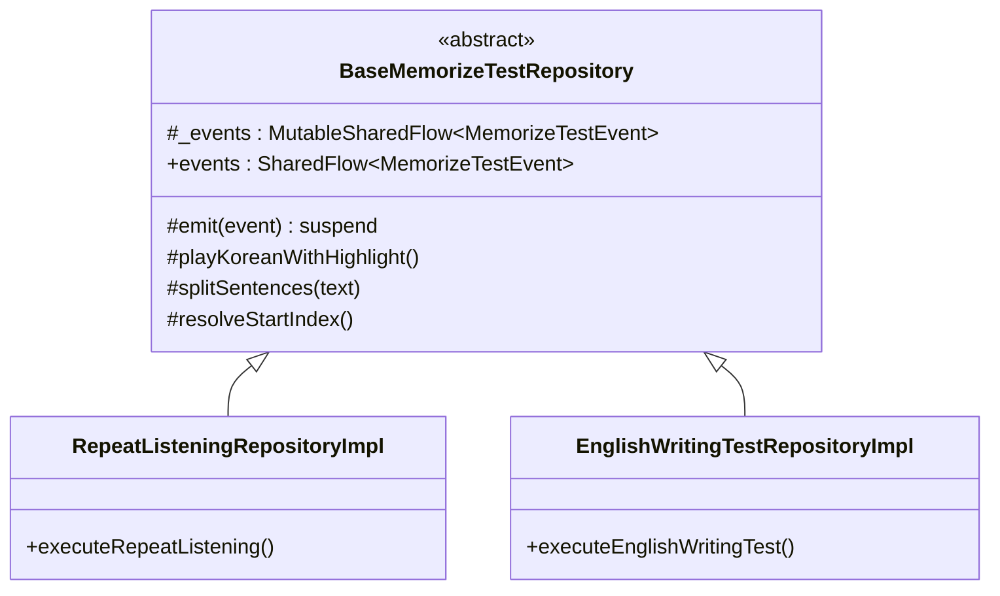
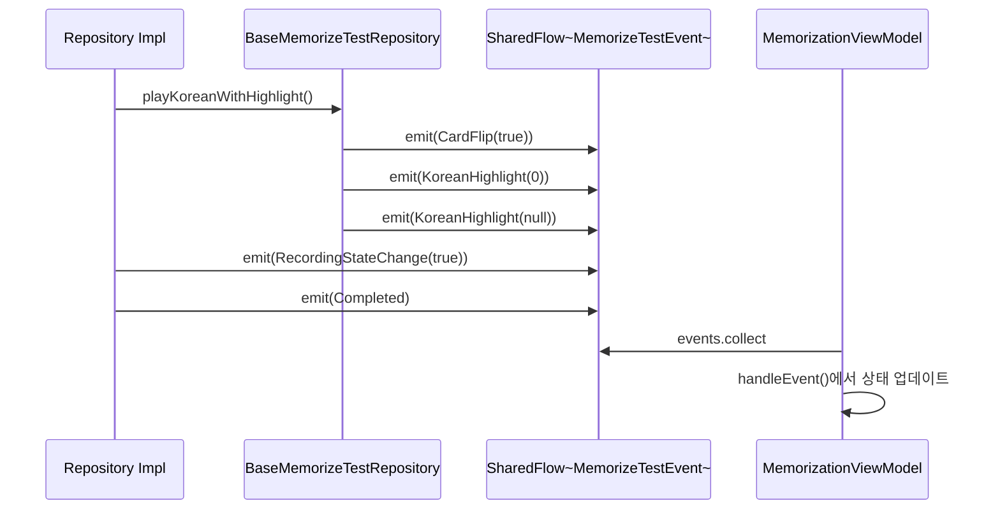

# Data 계층 아키텍처 상세

> Domain 인터페이스의 실제 구현. Android 프레임워크와 직접 통신.

## 1. 계층 역할 한 줄 요약

**Data = 앱의 손과 발**. Domain이 "이렇게 해라"라고 정의한 것을 Android API로 실제로 실행.

## 2. 패키지 구조

```
data/
├── audio/
│   ├── BaseTtsPlayer.kt
│   ├── BaseMediaPlayer.kt
│   ├── GoogleTtsPlayer.kt
│   ├── SamsungTtsPlayer.kt
│   ├── TtsOrchestratorImpl.kt
│   ├── TtsPlaybackControllerImpl.kt
│   ├── AudioRecorderImpl.kt
│   ├── AudioPlayerImpl.kt
│   └── RecordingAudioPlayerImpl.kt
├── local/
│   ├── AppDatabase.kt
│   ├── AssetSeeder.kt
│   ├── QaItemDao.kt
│   ├── QaItemEntity.kt
│   └── QaItemEntityMappers.kt
├── manager/
│   ├── AndroidLogger.kt
│   └── WakeLockControllerImpl.kt
├── repository/
│   ├── BaseMemorizeTestRepository.kt
│   ├── RepeatListeningRepositoryImpl.kt
│   ├── EnglishWritingTestRepositoryImpl.kt
│   ├── LeveledQaDataLoader.kt
│   ├── RoomQaDataLoader.kt
│   ├── QaDataManagerImpl.kt
│   ├── ScriptEditRepositoryImpl.kt
│   ├── StudySessionRepositoryImpl.kt
│   ├── ProgressPersistenceServiceImpl.kt
│   ├── UserPreferencesRepository.kt
│   ├── RecordingFileRepositoryImpl.kt
│   ├── RecordingTimeManagerImpl.kt
│   └── AudioFileManagerImpl.kt
└── usecase/
    └── MemorizationModeCoordinatorImpl.kt
```

## 3. TTS 재생 보장 메커니즘 (BaseTtsPlayer)

TTS 엔진은 불안정해서 그냥 `speak()`만 부르면 안 됩니다. BaseTtsPlayer는 4단계 보장 메커니즘을 사용:

```
speak() 호출 (speakMutex로 직렬화)
  │
  ▼
┌──────────────────────────────────────┐
│ 1단계: isSpeaking 폴링 + 정착 대기    │
│    stop() 후 TTS 엔진이 정지할 때까지  │
│    50ms 간격으로 최대 40회 확인        │
│    (최대 2초 대기)                    │
│    + 폴링 발생 시 150ms 정착 대기      │
│    (ENGINE_SETTLE_DELAY_MS)           │
├──────────────────────────────────────┤
│ 2단계: speak() 반환값 검사            │
│    ERROR 반환 시 즉시 실패 처리        │
├──────────────────────────────────────┤
│ 3단계: onStart 콜백 대기              │
│    실제 재생이 시작되었는지 확인        │
│    (2초 타임아웃, 초과 시 실패)        │
├──────────────────────────────────────┤
│ 4단계: 재생 완료 대기                 │
│    completionDeferred.await()        │
│    (30초 안전 타임아웃)               │
└──────────────────────────────────────┘
  │
  ▼
speak() 반환 (재생 완료 후)
```

**동시성 보호**: `speakMutex`(Mutex)가 전체 speak() 본문을 래핑하여, 여러 코루틴에서 동시에 speak()를 호출해도 `UtteranceProgressListener`가 덮어씌워지지 않음.

## 4. 오디오 파일 병합 전략 (AudioFileManagerImpl)

```
병합 요청 (mergeAudioFiles)
  │
  ▼
파일이 1개인가? ──예──→ 파일 복사만 (copyTo)
  │
  아니오
  ▼
┌──────────────────────────────────────────────┐
│ mergeWithMediaCodec (유일 전략)              │
│ MediaExtractor + MediaMuxer                  │
│ 각 파일의 오디오 트랙을 디먹스→리먹스        │
├──────────────────────────────────────────────┤
│ 실패 시: null 반환 (폴백 없음)               │
│ 예외 발생 시: 로깅 후 null 반환               │
└──────────────────────────────────────────────┘
```

**주의**: 과거에는 3단계 폴백(mergeWithMediaCodec → mergeWithHeaderAnalysis → 파일 연결)이 존재했으나, `mergeWithHeaderAnalysis`와 파일 연결 폴백은 모두 제거됨. 현재는 MediaCodec 단일 전략만 사용하며, 실패 시 원본 파일을 유지하고 `null`을 반환.

## 5. SharedFlow 이벤트 패턴

반복듣기와 영작테스트는 `BaseMemorizeTestRepository` 추상 클래스를 상속하여 SharedFlow 이벤트를 발행합니다:





**이벤트 종류**:

| 이벤트 | 발행 주체 | 설명 |
|-------|----------|------|
| `CardFlip(Boolean)` | Base + 양쪽 Repo | 카드 뒤집기 |
| `KoreanHighlight(Int?)` | Base + 영작 Repo | 한국어 하이라이트 |
| `Highlight(Int?)` | 반복듣기 | 영어 하이라이트 |
| `RecordingHighlight(Int?)` | 영작 Repo | 녹음 하이라이트 |
| `RecordingStateChange(Boolean)` | 영작 Repo | 녹음 상태 변경 |
| `MergedFileCreated` | 영작 Repo | 병합 파일 생성 완료 |
| `Completed` | 양쪽 Repo | 테스트 완료 |

## 6. SharedPreferences 분포

SharedPreferences 키 상세: [ARCHITECTURE.md 섹션 6](ARCHITECTURE.md)

## 7. 과거 구조적 문제 해결 이력

해결된 이슈: [REFACTORING_CHANGELOG.md](REFACTORING_CHANGELOG.md)
