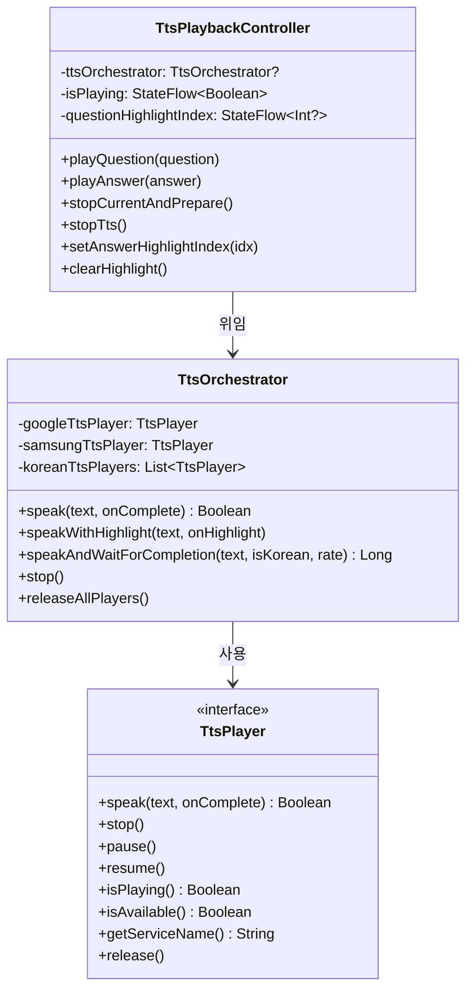
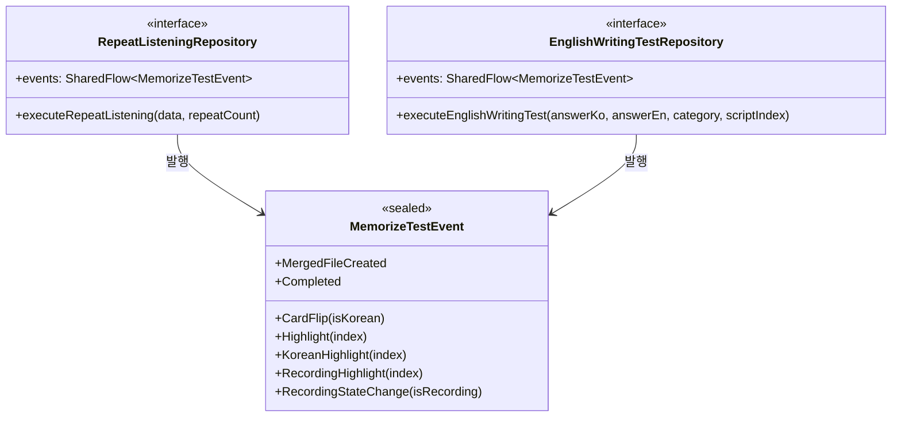
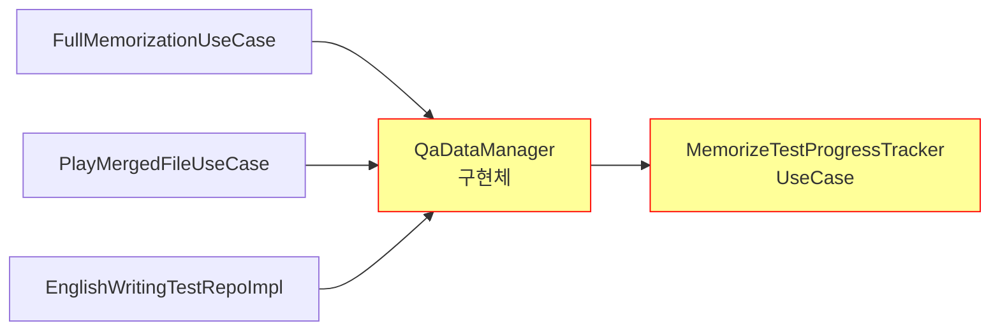
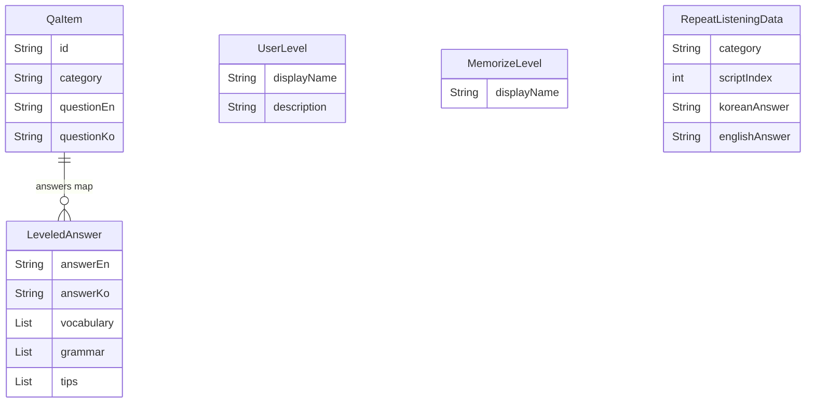

# Domain 계층 아키텍처 상세

> 비즈니스 로직의 핵심. 이 계층을 이해하면 앱이 "무엇을 하는지"를 알 수 있습니다.

## 1. 계층 역할 한 줄 요약

**Domain = 앱의 두뇌**. "무엇을 해야 하는가"를 정의하고, "어떻게 하는가"는 Data 계층에 맡김.

## 2. 패키지 구조

```
domain/
├── audio/              ← 오디오 인터페이스 + 컨트롤러 (실제 구현은 Data)
│   ├── TtsPlayer.kt           TTS 엔진 공통 인터페이스
│   ├── AudioPlayer.kt         오디오 파일 재생 인터페이스
│   ├── AudioRecorder.kt       녹음 인터페이스
│   ├── RecordingAudioPlayer.kt 녹음 재생 인터페이스
│   ├── MemorizeTestEvent.kt   암기테스트 이벤트 (SharedFlow용)
│   ├── TtsOrchestrator.kt     🧠 언어 감지 → TTS 라우팅
│   └── TtsPlaybackController.kt 🧠 재생 상태 관리
├── entity/             ← 데이터 모델 (순수 Kotlin, Android 의존 없음)
│   ├── QaItem.kt              핵심 QA 데이터
│   ├── UserLevel.kt           OPIc 시험 레벨 Enum
│   ├── MemorizeLevel.kt       암기 모드 Enum
│   ├── RepeatListeningData.kt 반복듣기 입력 데이터
│   └── ProgressData.kt        진행상황 엔티티
├── manager/            ← 시스템 매니저
│   └── WakeLockManager.kt     화면 꺼짐 방지
├── repository/         ← 인터페이스 (Data가 구현함)
│   ├── QaDataLoader.kt        JSON 로딩 인터페이스
│   ├── QaDataManager.kt       ⚠️ 구현체 (인터페이스 아님!)
│   ├── UserPreferencesRepository.kt
│   ├── ProgressPersistenceService.kt
│   ├── RecordingFileRepository.kt
│   ├── RecordingTimeManager.kt
│   ├── RepeatListeningRepository.kt
│   ├── EnglishWritingTestRepository.kt
│   ├── AudioFileManager.kt
│   └── ScriptProgress.kt      ⚠️ 데이터 클래스 (entity/로 이동 검토)
└── usecase/            ← 비즈니스 유스케이스
    ├── ExecuteRepeatListeningUseCase.kt    얇은 래퍼
    ├── ExecuteEnglishWritingTestUseCase.kt 얇은 래퍼
    ├── FullMemorizationUseCase.kt          🧠 통암기 직접 로직
    ├── RepeatListeningUseCase.kt           🧠 반복듣기 독립 로직
    ├── PlayMergedFileUseCase.kt            🧠 병합 파일 재생
    └── MemorizeTestProgressTracker.kt      진행상황 메모리 관리
```

## 3. 클래스 관계 다이어그램





## 4. UseCase 책임 분석

```
┌────────────────────────────────────────────────────────┐
│                    UseCase 분류                         │
├─────────────┬──────────────────────────────────────────┤
│ 얇은 래퍼    │ ExecuteRepeatListeningUseCase            │
│ (위임만)     │ ExecuteEnglishWritingTestUseCase         │
│             │ → Repository의 events를 그대로 노출       │
│             │ → 메서드 호출만 위임                       │
├─────────────┼──────────────────────────────────────────┤
│ 실질적 로직  │ FullMemorizationUseCase                  │
│             │ → TTS + 녹음 + 파일 관리 직접 수행        │
│             │ RepeatListeningUseCase                    │
│             │ → TTS + 적응형 딜레이 직접 수행           │
│             │ PlayMergedFileUseCase                     │
│             │ → 파일 재생 + 하이라이트 직접 수행         │
└─────────────┴──────────────────────────────────────────┘
```

**문제점**: RepeatListeningUseCase와 RepeatListeningRepositoryImpl이 거의 동일한 로직을 가짐 (코드 중복).

## 5. QaDataManager — 특이사항

QaDataManager는 `domain/repository/`에 위치하지만 **인터페이스가 아닌 구현체**입니다:



**문제점**:
1. Domain의 Repository 패키지에 구현체가 있음 (위치 불일치)
2. QaDataManager가 MemorizeTestProgressTracker(UseCase)를 직접 참조 (역의존성)
3. Data 계층(EnglishWritingTestRepoImpl)이 QaDataManager를 직접 import

## 6. 엔티티 관계


