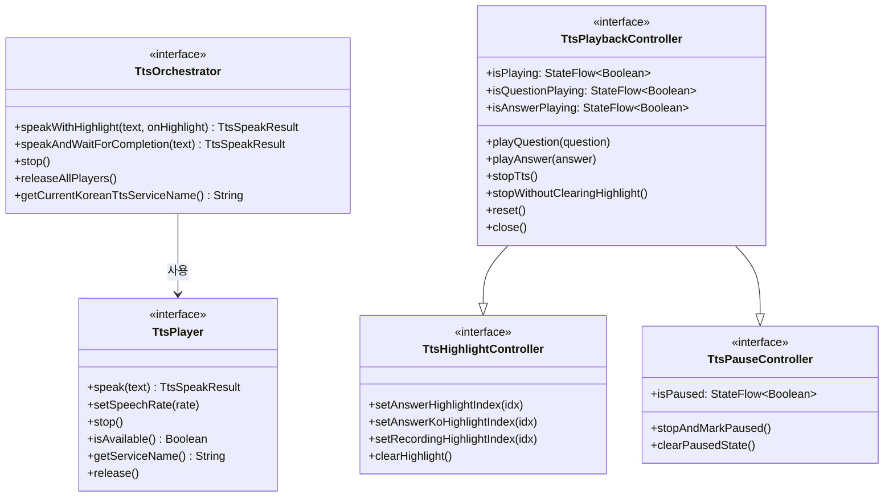
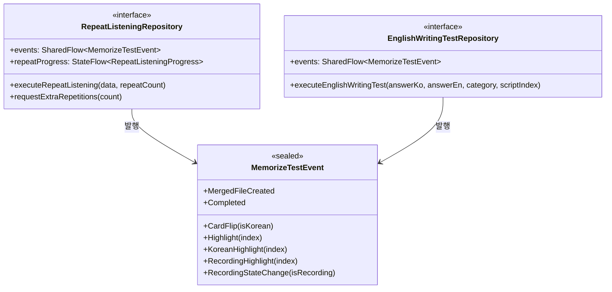
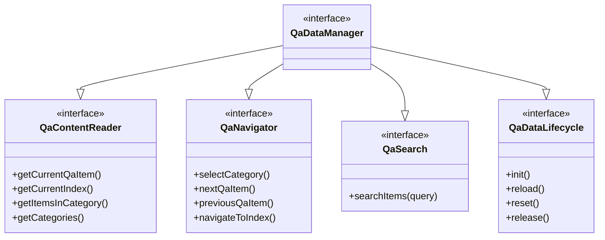
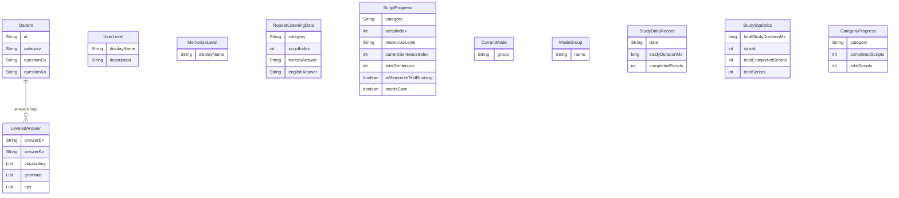

# Domain 계층 아키텍처 상세

> 비즈니스 로직의 핵심. 이 계층을 이해하면 앱이 "무엇을 하는지"를 알 수 있습니다.

## 1. 계층 역할 한 줄 요약

**Domain = 앱의 두뇌**. "무엇을 해야 하는가"를 정의하고, "어떻게 하는가"는 Data 계층에 맡김.

## 2. 패키지 구조

```
domain/
├── audio/
│   ├── TtsPlayer.kt
│   ├── TtsSpeakResult.kt
│   ├── TtsOrchestrator.kt
│   ├── TtsPlaybackController.kt
│   ├── TtsHighlightController.kt
│   ├── TtsPauseController.kt
│   ├── HighlightStateHolder.kt
│   ├── AudioPlayer.kt
│   ├── AudioRecorder.kt
│   ├── RecordingAudioPlayer.kt
│   ├── MemorizeTestEvent.kt
│   ├── SentenceSplitter.kt
│   ├── PipState.kt
│   ├── PipStateAggregator.kt
│   ├── PlaybackActionListener.kt
│   └── RepeatListeningProgress.kt
├── entity/
│   ├── QaItem.kt
│   ├── UserLevel.kt
│   ├── MemorizeLevel.kt
│   ├── RepeatListeningData.kt
│   ├── ScriptProgress.kt
│   ├── CurrentMode.kt
│   ├── StudyDailyRecord.kt
│   └── StudyStatistics.kt
├── manager/
│   ├── AppLogger.kt
│   └── WakeLockController.kt
├── repository/
│   ├── QaDataLoader.kt
│   ├── QaDataManager.kt
│   ├── QaContentReader.kt
│   ├── QaNavigator.kt
│   ├── QaSearch.kt
│   ├── QaDataLifecycle.kt
│   ├── DataSeeder.kt
│   ├── UserPreferencesRepository.kt
│   ├── UserLevelPreferences.kt
│   ├── TtsPreferences.kt
│   ├── PlaybackPreferences.kt
│   ├── OnboardingPreferences.kt
│   ├── MemorizeLevelPreferences.kt
│   ├── AppDataPreferences.kt
│   ├── ProgressPersistenceService.kt
│   ├── RecordingFileRepository.kt
│   ├── RecordingTimeManager.kt
│   ├── RepeatListeningRepository.kt
│   ├── EnglishWritingTestRepository.kt
│   ├── AudioFileManager.kt
│   ├── ScriptEditRepository.kt
│   ├── StudySessionRepository.kt
│   ├── StudySessionRecorder.kt
│   ├── StudySessionStatisticsReader.kt
│   └── TtsServiceController.kt
└── usecase/
    ├── MemorizationModeCoordinator.kt
    ├── FullMemorizationUseCase.kt
    ├── PlayMergedFileUseCase.kt
    ├── MemorizeTestProgressTracker.kt
    ├── ProgressCleanupUseCase.kt
    ├── RecordStudySessionUseCase.kt
    ├── StudyStatisticsCalculator.kt
    └── ValidateScriptEditUseCase.kt
```

## 3. 클래스 관계 다이어그램

### TTS 인터페이스 계층



### 암기테스트 이벤트



## 4. UseCase 분류

UseCase 상세 (의존성, 주의사항): [domain/CLAUDE.md](../../app/src/main/java/com/na982/opichelper/domain/CLAUDE.md)

| 분류 | UseCase |
|------|---------|
| 실질적 로직 | `FullMemorizationUseCase`, `PlayMergedFileUseCase` |
| 상태 관리 | `MemorizeTestProgressTracker` |
| 코디네이터 | `MemorizationModeCoordinator` |
| 정리 | `ProgressCleanupUseCase` |
| 기록 | `RecordStudySessionUseCase` |
| 계산 | `StudyStatisticsCalculator` |
| 검증 | `ValidateScriptEditUseCase` |

## 5. QaDataManager — 현재 상태

QaDataManager는 **인터페이스**로 정의되어 있으며, 4개 하위 인터페이스를 상속합니다:



## 6. 엔티티 관계


