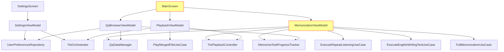
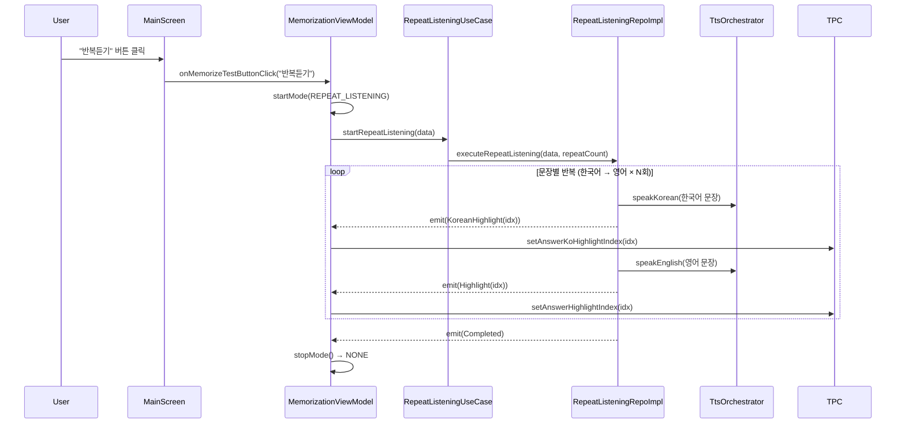
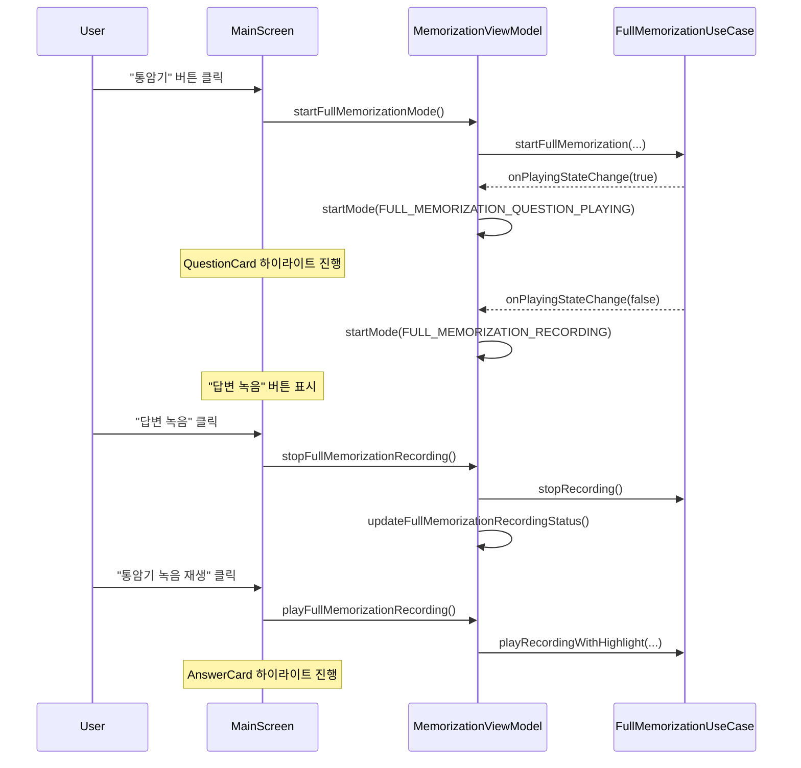

# Presentation 계층 아키텍처 상세

> 사용자가 보는 화면과 상태 관리. 이 계층을 이해하면 앱이 "어떻게 보이고 동작하는지"를 알 수 있습니다.

## 1. 계층 역할 한 줄 요약

**Presentation = 앱의 얼굴**. 사용자의 입력을 받아 ViewModel로 전달하고, ViewModel의 상태를 화면에 표시.

## 2. 패키지 구조

```
presentation/
├── ui/
│   ├── component/              ← 재사용 컴포저블
│   │   ├── FlipCard.kt            3D 플립 애니메이션 카드
│   │   └── HighlightText.kt       하이라이트 텍스트
│   ├── navigation/
│   │   └── AppNavigation.kt       NavHost (Main ↔ Settings)
│   └── screen/
│       ├── MainScreen.kt          🧠 메인 화면 (3개 ViewModel 결합)
│       ├── SettingsScreen.kt      설정 화면
│       └── MainScreenComponentsUI/ ← MainScreen 하위 컴포넌트
│           ├── AppTitle.kt
│           ├── CategorySelector.kt
│           ├── MemorizeLevelSelector.kt
│           ├── QuestionCard.kt
│           ├── AnswerCard.kt
│           ├── QuestionPlayButton.kt
│           ├── AnswerPlayButton.kt
│           ├── MemorizeLevelPlaybackButton.kt
│           ├── FullMemorizationRecordingButton.kt
│           ├── RecordingAnimation.kt
│           ├── NavigationSection.kt
│           ├── NextQuestionButton.kt
│           └── PreviousQuestionButton.kt
└── viewmodel/
    ├── QaBrowserViewModel.kt      QA 탐색 + 카테고리
    ├── PlaybackViewModel.kt       TTS 재생 + 병합 파일
    ├── MemorizationViewModel.kt   🧠 암기 테스트 3모드
    ├── SettingsViewModel.kt       설정
    ├── MemorizationUiState.kt     암기 테스트 UI 상태
    └── CurrentMode.kt             암기 테스트 모드 Enum
```

## 3. ViewModel 관계도



**빨간색 테두리**: 구조적 문제가 있는 컴포넌트

## 4. MainScreen 상태 수집 구조 (현재 — 11개 StateFlow)

```
┌─ MainScreen ──────────────────────────────────────────────┐
│                                                            │
│  from PlaybackViewModel:                                   │
│    ├── uiState (PlaybackState)                             │
│    ├── hasEnglishWritingTestMergedFile                     │
│    ├── isEnglishWritingTestMergedFilePlaying               │
│    └── englishWritingTestMergedFileHighlightIndex          │
│                                                            │
│  from QaBrowserViewModel:                                  │
│    └── uiState (QaBrowserState)                            │
│                                                            │
│  from MemorizationViewModel:                               │
│    ├── uiState (MemorizationUiState)                       │
│    ├── memorizeLevels                                      │
│    ├── isQuestionCardFlipped                               │
│    ├── englishWritingTestCompleted                         │
│    ├── stopEnglishWritingTestMergedFilePlaying             │
│    └── fullMemorizationHighlightIndex                      │
│                                                            │
│  지역 계산:                                                 │
│    isFullMemorizationMode ← selectedLevel에서 파생          │
│    hasFullMemorizationRecording ← hasFullMemorizationRec..File│
│                                                            │
└────────────────────────────────────────────────────────────┘
```

**문제**: "UI는 ViewModel의 StateFlow만 구독" 규칙에 어긋남. 각 ViewModel이 단일 통합 상태를 제공해야 함.

## 5. 암기 테스트 UI 상태 흐름

### 5.1 반복듣기 모드



### 5.2 통암기 모드



## 6. 하이라이트 소스 분기 (MainScreen의 핵심 로직)

현재 재생 중인 모드에 따라 어떤 하이라이트 인덱스를 사용할지 결정:

```
QuestionCard.highlightIndex:
  ├── 통암기 모드 + 재생 중 → fullMemorizationHighlightIndex
  └── 그 외 → playbackState.questionHighlight.index

AnswerCard.highlightIndex:
  ├── 통암기 모드 + 재생 중 OR 녹음재생 중 → fullMemorizationHighlightIndex
  ├── 영작테스트 병합파일 재생 중 → englishWritingTestMergedFileHighlightIndex
  └── 그 외 → playbackState.answerHighlight.index

isFullMemorizationMode 판별:
  MainScreen: selectedLevel == FULL_MEMORIZATION (사용자 선택 기준)
  UiState: currentMode가 FULL_MEMORIZATION 계열 (내부 상태 기준)
  → 두 정의가 다를 수 있음! MainScreen은 selectedLevel 기준 사용
```

## 7. ⚠️ 알려진 구조적 문제

| 문제 | 설명 | 영향 |
|------|------|------|
| MemorizationViewModel SRP 위반 | 3개 암기 모드 + 6개 분산 StateFlow를 하나의 ViewModel이 관리 | 모드 추가 시 ViewModel이 계속 비대해짐 |
| MainScreen 다중 수집 | 11개 StateFlow를 개별 collect | 상태 추적 어려움, recomposition 최적화 어려움 |
| ViewModel을 Composable에 전달 | MemorizeLevelPlaybackButton이 ViewModel 인스턴스를 직접 수신 | Composable 재사용성 저하, 테스트 어려움 |
| 미사용 파라미터 | QuestionPlayButton, AnswerPlayButton, RecordingAnimation | API 표면적 낭비 |
| FlipCard 상태 섀도잉 | 내부 상태가 외부 isFlipped를 덮어쓰는 패턴 | 상태 불일치 가능성 |
| 미사용 컴포넌트 | RecordingButton, RecordingSection, QuestionAnswerSection | 코드 혼란 |
