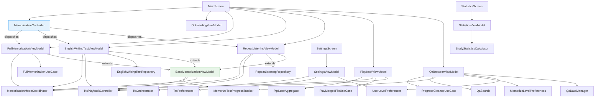
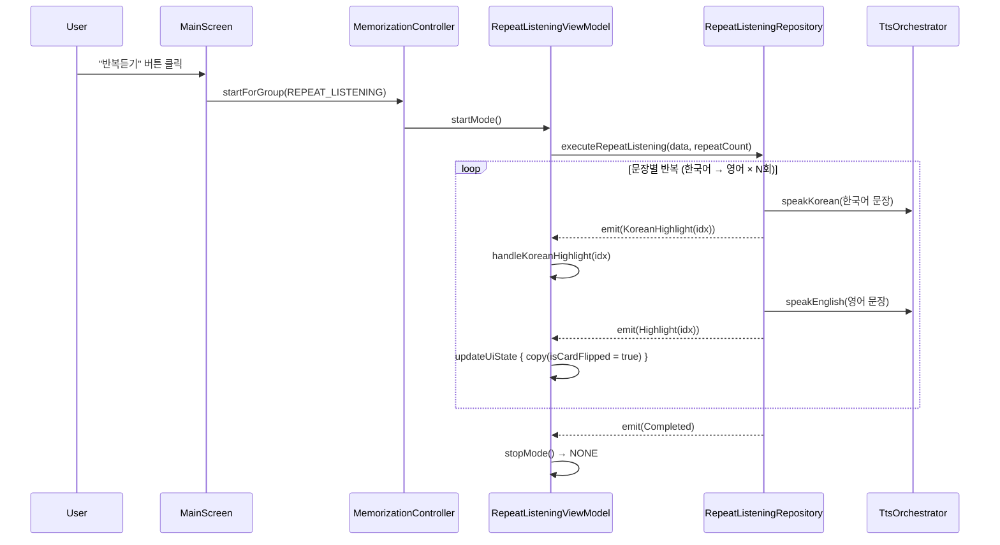
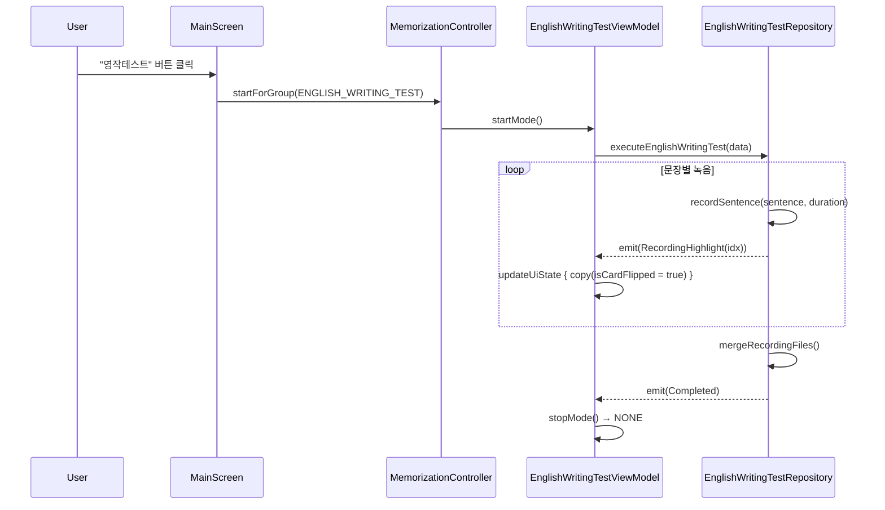
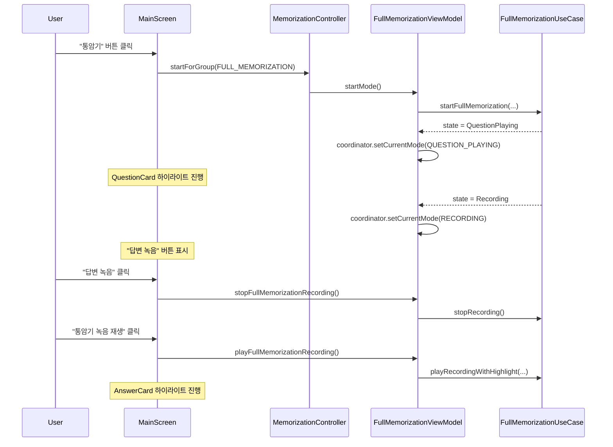
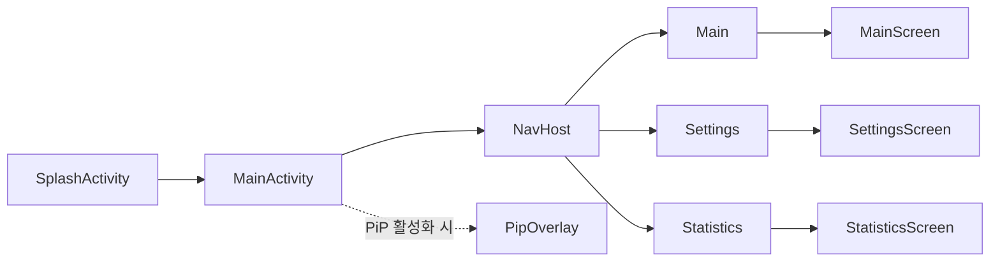
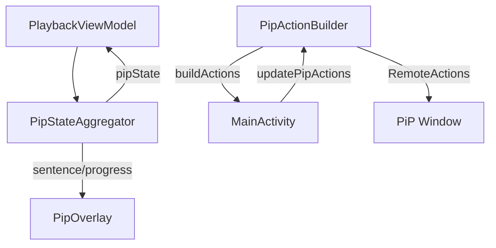

# Presentation 계층 아키텍처 상세

> 사용자가 보는 화면과 상태 관리. 이 계층을 이해하면 앱이 "어떻게 보이고 동작하는지"를 알 수 있습니다.

## 1. 계층 역할 한 줄 요약

**Presentation = 앱의 얼굴**. 사용자의 입력을 받아 ViewModel로 전달하고, ViewModel의 상태를 화면에 표시.

## 2. 패키지 구조

```
presentation/
├── ui/
│   ├── PipActionBuilder.kt
│   ├── component/
│   │   ├── EditScriptBottomSheet.kt
│   │   ├── FlipCard.kt
│   │   ├── HighlightText.kt
│   │   ├── OnboardingDialog.kt
│   │   ├── PipOverlay.kt
│   │   ├── PipPermissionDialog.kt
│   │   ├── PlayStopToggleButton.kt
│   │   ├── SearchDialog.kt
│   │   └── SectionHeader.kt
│   ├── navigation/
│   │   └── AppNavigation.kt
│   └── screen/
│       ├── MainScreen.kt
│       ├── SettingsScreen.kt
│       ├── StatisticsScreen.kt
│       ├── AnswerSection.kt
│       ├── CategoryLevelRow.kt
│       ├── QuestionActionRow.kt
│       ├── HighlightIndexResolver.kt
│       ├── MainScreenDialogs.kt
│       ├── MainScreenSideEffects.kt
│       ├── MainScreenSnackbarCollector.kt
│       ├── EditScriptState.kt
│       ├── PipInfoSection.kt
│       ├── PlaybackSettingsSection.kt
│       ├── AppInfoSection.kt
│       ├── UserLevelSection.kt
│       ├── SettingsScreenComponents.kt
│       └── MainScreenComponentsUI/
│           ├── AppTitle.kt
│           ├── CategorySelector.kt
│           ├── MemorizeLevelSelector.kt
│           ├── QuestionCard.kt
│           ├── AnswerCard.kt
│           ├── QuestionPlayButton.kt
│           ├── AnswerPlayButton.kt
│           ├── MemorizeLevelPlaybackButton.kt
│           ├── FullMemorizationRecordingButton.kt
│           ├── RecordingAnimation.kt
│           ├── NavigationSection.kt
│           ├── NextQuestionButton.kt
│           └── PreviousQuestionButton.kt
└── viewmodel/
    ├── BaseMemorizationViewModel.kt
    ├── RepeatListeningViewModel.kt
    ├── EnglishWritingTestViewModel.kt
    ├── FullMemorizationViewModel.kt
    ├── MemorizationController.kt
    ├── QaBrowserViewModel.kt
    ├── PlaybackViewModel.kt
    ├── SettingsViewModel.kt
    ├── OnboardingViewModel.kt
    ├── EditScriptViewModel.kt
    └── StatisticsViewModel.kt
```

## 3. ViewModel 관계도



**초록색**: Template Method 기반 클래스 | **파란색**: OCP 준수 중앙 디스패처

## 4. ViewModel 상세

### 4.1 BaseMemorizationViewModel (abstract)

3개 암기 모드 ViewModel의 공통 기반. Template Method 패턴으로 생명주기 일관성 보장.

| 항목 | 내용 |
|------|------|
| 의존성 | `MemorizationModeCoordinator`, `TtsPlaybackController`, `MemorizeTestProgressTracker`, `AppLogger`, `QaContentReader` |
| 공통 StateFlow | `uiState: StateFlow<T>`, `events: SharedFlow<String>` |
| 공통 메서드 | `startMode()`, `stopMode()`, `onLevelChanged()`, `handleKoreanHighlight()` |
| 코루틴 관리 | `modeJob: Job` (자식 코루틴 취소 보장) |

### 4.2 RepeatListeningViewModel

반복듣기 모드 전담. TTS 실행을 `RepeatListeningRepository`에 위임.

| 항목 | 내용 |
|------|------|
| 의존성 | `RepeatListeningRepository`, `TtsPlaybackController`, `QaContentReader`, `QaNavigator`, `MemorizeTestProgressTracker`, `PlaybackPreferences`, `MemorizationModeCoordinator`, `AppLogger` |
| UiState | `RepeatListeningUiState` (isCardFlipped, isPlaying, resumeSentenceIndex) |
| 주요 기능 | 카드 플립/하이라이트, 자동 진행, 문장 반복 요청 |

### 4.3 EnglishWritingTestViewModel

영작테스트 모드 전담. 녹음/TTS 실행을 `EnglishWritingTestRepository`에 위임.

| 항목 | 내용 |
|------|------|
| 의존성 | `EnglishWritingTestRepository`, `TtsPlaybackController`, `QaContentReader`, `MemorizeTestProgressTracker`, `MemorizationModeCoordinator`, `AppLogger` |
| UiState | `EnglishWritingTestUiState` (isCardFlipped) |
| 주요 기능 | 녹음 상태, 병합 파일 생성, 완료 이벤트 |

### 4.4 FullMemorizationViewModel

통암기 모드 전담. `FullMemorizationUseCase` 상태를 UI에 반영.

| 항목 | 내용 |
|------|------|
| 의존성 | `FullMemorizationUseCase`, `QaContentReader`, `MemorizationModeCoordinator`, `TtsPlaybackController`, `MemorizeTestProgressTracker`, `AppLogger` |
| UiState | `FullMemorizationUiState` (hasRecordingFile, highlightIndex, currentSentenceEn, currentSentenceKo) |
| 주요 기능 | 녹음 정지, 녹음 재생, 재생 취소, 코디네이터 모드 동기화 |

### 4.5 MemorizationController

3개 암기 ViewModel에 대한 중앙 디스패처. `ModeGroup → ViewModel` 맵으로 OCP 준수.

| 항목 | 내용 |
|------|------|
| 의존성 | `Map<ModeGroup, BaseMemorizationViewModel<*>>` |
| 메서드 | `startForGroup()`, `stopForGroup()`, `stopCurrent()`, `stopAll()`, `onLevelChangedAll()` |
| 역할 | when 분기 중복 제거, 새 모드 추가 시 ViewModel만 맵에 등록 |

### 4.6 PlaybackViewModel

TTS 재생 + PiP 상태 관리. 다중 TTS 컨트롤러 StateFlow를 단일 `PlaybackState`로 통합.

| 항목 | 내용 |
|------|------|
| 의존성 | `TtsPlaybackController`, `PlayMergedFileUseCase`, `MemorizationModeCoordinator`, `PlaybackPreferences`, `PipStateAggregator`, `AppLogger` |
| UiState | `PlaybackState` (isPlaying, isQuestionPlaying, isAnswerPlaying, questionHighlight, answerHighlight, answerKoHighlight, recordingHighlight, hasEnglishWritingTestMergedFile, isEnglishWritingTestMergedFilePlaying, englishWritingTestMergedFileHighlightIndex) |
| 추가 StateFlow | `pipState: StateFlow<PipState>` |
| PiP 위임 | `pipStateAggregator` 직접 노출 |

### 4.7 QaBrowserViewModel

QA 데이터 탐색, 카테고리, 암기레벨, 검색, 진행상황 관리.

| 항목 | 내용 |
|------|------|
| 의존성 | `QaDataManager`, `UserLevelPreferences`, `PlaybackPreferences`, `MemorizeLevelPreferences`, `MemorizeTestProgressTracker`, `QaSearch`, `ProgressCleanupUseCase`, `AppLogger` |
| UiState | `QaBrowserState` (currentQaItem, currentCategory, isLoading, error, categories, selectedMemorizeLevel, currentUserLevel, answerPlayCount, completedCount) |

### 4.8 SettingsViewModel

설정 화면 전용. 세분화된 Preferences 인터페이스에 의존.

| 항목 | 내용 |
|------|------|
| 의존성 | `UserLevelPreferences`, `TtsPreferences`, `PlaybackPreferences`, `TtsOrchestrator` |
| UiState | `SettingsUiState` (currentUserLevel, currentKoreanTtsService, repeatListeningCount, answerPlayCount, englishTtsRate) |

### 4.9 OnboardingViewModel

온보딩/PiP 가이드 완료 상태 관리.

| 항목 | 내용 |
|------|------|
| 의존성 | `OnboardingPreferences` |
| 메서드 | `isOnboardingCompleted()`, `setOnboardingCompleted()`, `isPipGuideCompleted()`, `setPipGuideCompleted()` |

### 4.10 EditScriptViewModel

스크립트 편집 UI 상태 관리.

| 항목 | 내용 |
|------|------|
| 의존성 | `ScriptEditRepository`, `ValidateScriptEditUseCase`, `QaDataLifecycle` |
| StateFlow | `sentencePairs`, `validationResult` |

### 4.11 StatisticsViewModel

학습 통계 화면 상태 관리.

| 항목 | 내용 |
|------|------|
| 의존성 | `StudyStatisticsCalculator` |
| UiState | `StatisticsUiState` (isLoading, totalStudyDurationMs, streak, longestStreak, totalCompletedScripts, totalScripts, completionRate, modeBreakdown, dailyRecords, categoryProgress) |

## 5. MainScreen 상태 수집 구조 (현재 — 7개 StateFlow)

```
┌─ MainScreen ──────────────────────────────────────────────────┐
│                                                                │
│  from PlaybackViewModel:                                       │
│    └── uiState (PlaybackState)  ← 다중 TTS StateFlow 통합      │
│                                                                │
│  from QaBrowserViewModel:                                      │
│    └── uiState (QaBrowserState)                                │
│                                                                │
│  from MemorizationModeCoordinator:                             │
│    ├── currentMode (CurrentMode)                               │
│    └── isRunning (Boolean)                                     │
│                                                                │
│  from RepeatListeningViewModel:                                │
│    └── uiState (RepeatListeningUiState)                        │
│                                                                │
│  from EnglishWritingTestViewModel:                             │
│    └── uiState (EnglishWritingTestUiState)                     │
│                                                                │
│  from FullMemorizationViewModel:                               │
│    └── uiState (FullMemorizationUiState)                       │
│                                                                │
│  파생 상태 (derivedStateOf):                                    │
│    ├── isFullMemorizationPlaying ← coordinatorMode에서 파생     │
│    ├── isFullMemorizationRecording ← coordinatorMode에서 파생   │
│    └── isFullMemorizationQuestionPlaying ← coordinatorMode 파생│
│                                                                │
└────────────────────────────────────────────────────────────────┘
```

**개선**: 기존 11개 개별 StateFlow → 7개로 축소. 각 ViewModel이 단일 통합 UiState 제공.

## 6. 암기 테스트 UI 상태 흐름

### 6.1 반복듣기 모드



### 6.2 영작테스트 모드



### 6.3 통암기 모드



## 7. 하이라이트 소스 분기 (HighlightIndexResolver)

`HighlightIndexResolver`의 순수 함수가 현재 모드에 따라 어떤 하이라이트 인덱스를 사용할지 결정:

```
resolveQuestionHighlightIndex():
  ├── FULL_MEMORIZATION 그룹 + 재생 중 → fullMemorizationHighlightIndex
  └── 그 외 → playbackState.questionHighlight.index

resolveAnswerHighlightIndex():
  ├── FULL_MEMORIZATON 그룹 + 재생 중 → fullMemorizationHighlightIndex
  ├── 영작테스트 병합파일 재생 중 → englishWritingTestMergedFileHighlightIndex
  └── 그 외 → playbackState.answerHighlight.index
```

**개선**: 기존 MainScreen 내 인라인 조건문 → 순수 함수로 중앙화. 분기 로직이 한 곳에 집중되어 유지보수 용이.

## 8. MainScreen 분해 구조

MainScreen은 3개 위임 컴포저블로 부수 효과를 분리:

| 컴포넌트 | 역할 |
|----------|------|
| `MainScreenSideEffects` | LaunchedEffect 기반 부수 효과: 레벨 변경 전파, QA 아이템 변경 시 resumeIndex 갱신, 통암기 PiP 문장 동기화 |
| `MainScreenSnackbarCollector` | 5개 ViewModel 이벤트 흐름을 `merge` + 단일 `collect`로 통합 수집. 권한 거부/이어하기 안내 처리 |
| `MainScreenDialogs` | 다이얼로그/바텀시트 상태 관리: OnboardingDialog, PipPermissionDialog, SearchDialog, EditScriptBottomSheet |

## 9. 네비게이션



| 라우트 | 화면 | ViewModel |
|--------|------|-----------|
| `Main` (startDestination) | MainScreen | PlaybackViewModel, QaBrowserViewModel, RepeatListeningViewModel, EnglishWritingTestViewModel, FullMemorizationViewModel, OnboardingViewModel |
| `Settings` | SettingsScreen | SettingsViewModel |
| `Statistics` | StatisticsScreen | StatisticsViewModel |

**PiP 모드**: `pipState.isPipMode`가 true면 NavHost 전체를 `PipOverlay`로 교체. PiP 창에는 현재 영어 문장, 한국어 번역, 진행 바, 반복 횟수가 표시됨.

## 10. PiP 아키텍처



| 컴포넌트 | 역할 |
|----------|------|
| `PipStateAggregator` | PiP 관련 상태 집계 (문장, 진행률, 모드). PlaybackViewModel에 위임 |
| `PipActionBuilder` | PiP 창 RemoteAction 빌드. 모드별 컨텍스트 버튼 (재생/정지, 반복, 다음) |
| `PipOverlay` | PiP 모드 UI. 영어 문장, 한국어 번역, 진행 바, 반복 횟수 |

## 11. 알려진 구조적 문제 및 해결 현황

해결된 이슈: [REFACTORING_CHANGELOG.md](REFACTORING_CHANGELOG.md)
