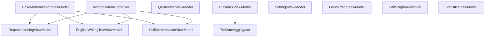

# CLAUDE.md - OPIc Helper 개발 가이드

## 가이드 사용법

이 파일은 프로젝트 전체 개요와 규칙을 담습니다. 모듈별 상세 정보는 각 계층의 CLAUDE.md를, 아키텍처 전체 구조는 아키텍처 문서를 참조:

- **코드 수정 시**: 수정 대상 계층의 CLAUDE.md를 먼저 읽고 해당 모듈의 구조와 규칙을 파악
- **신규 기능 추가 시**: 관련 계층 3개(data/domain/presentation)의 CLAUDE.md를 모두 확인
- **버그 수정 시**: 루트의 "알려진 기술 부채"와 해당 계층의 주의사항 확인
- **DI 변경 시**: `di/CLAUDE.md`에서 바인딩 규칙 확인
- **프로젝트 전체 파악**: [ARCHITECTURE.md](.claude/architecture/ARCHITECTURE.md) → 모듈별 아키텍처 문서 순서로 읽기

| 문서 | 내용 |
|------|------|
| [ARCHITECTURE.md](.claude/architecture/ARCHITECTURE.md) | 전체 아키텍처 개요, 다이어그램, 읽기 순서 |
| [ARCHITECTURE_DATA.md](.claude/architecture/ARCHITECTURE_DATA.md) | Data 계층 아키텍처 상세 |
| [ARCHITECTURE_DOMAIN.md](.claude/architecture/ARCHITECTURE_DOMAIN.md) | Domain 계층 아키텍처 상세 |
| [ARCHITECTURE_PRESENTATION.md](.claude/architecture/ARCHITECTURE_PRESENTATION.md) | Presentation 계층 아키텍처 상세 |
| [ARCHITECTURE_IMPROVEMENT_PLAN.md](.claude/plans/ARCHITECTURE_IMPROVEMENT_PLAN.md) | 구조적 결함 및 개선 계획 |
| [REFACTORING_PLAN.md](.claude/plans/REFACTORING_PLAN.md) | 리팩토링 계획 |
| [SCRIPT_EDIT_PLAN.md](.claude/plans/SCRIPT_EDIT_PLAN.md) | 스크립트 편집 기능 구현 계획 |
| `data/CLAUDE.md` | TTS 플레이어 구현체, Repository 구현체, SharedPreferences 키 맵 |
| `domain/CLAUDE.md` | Entity, UseCase, Repository 인터페이스, TTS 오케스트레이터, 재생 컨트롤러 |
| `presentation/CLAUDE.md` | ViewModel, Compose UI, 네비게이션, 상태 흐름 |
| `di/CLAUDE.md` | Hilt 바인딩 전체 목록, 제공 방식, 주의사항 |

## 프로젝트 개요

OPIc 영어 말하기 시험 대비 Android 앱. Clean Architecture + MVVM, Hilt DI, Jetpack Compose.

- **패키지**: `com.na982.opichelper`
- **minSdk**: 24 / **targetSdk**: 34
- **Kotlin**: 1.9.22 / **Compose BOM**: 2023.08.00

## 아키텍처

```
Presentation (Compose UI + ViewModel) → Domain (Entity + UseCase + Repository Interface) ← Data (Repository Impl + TTS Players + File Manager)
```

의존성은 항상 외부(Data) → 내부(Domain) 방향. Domain은 Data를 직접 참조하지 않음.

### ViewModel 구조
9개 ViewModel + MemorizationModeCoordinator(@Singleton). 상세 의존성/UiState는 [ARCHITECTURE_PRESENTATION.md](.claude/architecture/ARCHITECTURE_PRESENTATION.md) 참조.



### TTS 재생 흐름 (핵심 경로)
[ARCHITECTURE.md 섹션 3](.claude/architecture/ARCHITECTURE.md)에서 시퀀스 다이어그램 참조.

**주의**: `stopWithoutClearingHighlight()` 대신 `stopTts()` 사용. 이중 stop 호출은 TTS 엔진을 불안정하게 만듦.

### DI
- 싱글톤 바인딩: `di/AppModule.kt` (@Provides @Singleton). 전체 목록: [di/CLAUDE.md](app/src/main/java/com/na982/opichelper/di/CLAUDE.md)
- 자동 제공: `@Singleton` + `@Inject constructor` (HighlightStateHolder, MemorizeTestProgressTracker 등)
- **이중 등록 금지**: @Inject constructor와 @Provides 양쪽에 등록하지 않음
- ViewModel: `@HiltViewModel` + `@Inject constructor`

### 네비게이션
[ARCHITECTURE_PRESENTATION.md 섹션 9](.claude/architecture/ARCHITECTURE_PRESENTATION.md) 참조.

## 앱 진입점 & 루트 파일
[ARCHITECTURE.md 섹션 8](.claude/architecture/ARCHITECTURE.md) 참조.

## Assets 구조

```
assets/
  al/           — Advanced Low 레벨 (15개 JSON)
  ih/           — Intermediate High 레벨 (16개 JSON, qa_roleplay 포함)
  ih_raw/       — IH Raw 레벨 (15개 JSON, qa_roleplay 없음)
  im/           — Intermediate Mid 레벨 (15개 JSON)
```

JSON 포맷: `{ "title": "한글 카테고리명", "items": [{ id, question_en, question_ko, answers: { "AL": { answer_en, answer_ko, vocabulary, grammar, tips }, ... } }] }`
`theme` 필드는 일부 JSON에만 존재하며 파싱 시 무시됨.
새 JSON 추가 시 코드 수정 없이 assets에 넣기만 하면 자동 인식 (동적 카테고리 로딩).

## 코딩 컨벤션

### SOLID 원칙
- **SRP**: 각 클래스는 하나의 변경 이유만 가져야 함. ViewModel이 비대해지면 새 ViewModel로 분리
- **OCP**: TTS 플레이어 추가 시 `TtsPlayer` 인터페이스 구현체만 추가 (Orchestrator 수정 불필요)
- **LSP**: BaseTtsPlayer 하위 클래스는 치환 가능해야 함
- **ISP**: Repository 인터페이스는 UI 콜백을 받지 않아야 함 (SharedFlow 이벤트로 대체 완료)
- **DIP**: Domain 계층은 Data 계층을 직접 참조하지 않아야 함

### 네이밍
- Repository 인터페이스: `domain/repository/`에 정의
- Repository 구현체: `data/repository/`에 `~Impl` 접미사
- UseCase: `domain/usecase/`에 `~UseCase` 접미사
- StateFlow: `_` 접두사는 private, 공개는 읽기 전용

### Compose
- UI 컴포넌트: `presentation/ui/screen/MainScreenComponentsUI/`
- 재사용 컴포넌트: `presentation/ui/component/`
- 상태 구독: ViewModel의 StateFlow를 `collectAsState()`로 구독

### 로깅
`AppLogger` 인터페이스 사용. 각 계층 CLAUDE.md 참조.

## 코드 리뷰 체크리스트

### 필수 확인
- [ ] Domain 계층이 Data 계층을 직접 import하지 않는지
- [ ] Data 계층이 Domain 구현체(UseCase, QaDataManager)를 직접 import하지 않는지
- [ ] Repository 인터페이스에 UI 콜백이 없는지
- [ ] CoroutineScope가 적절히 취소되는지 (메모리 누수 방지)
- [ ] StateFlow 업데이트가 스레드 안전한지
- [ ] TTS stop() 후 speak() 호출 시 경쟁 상태가 없는지

### 보안 확인
- [ ] API 키, 비밀번호 등이 코드에 하드코딩되지 않았는지
- [ ] SharedPreferences에 민감 정보를 평문 저장하지 않는지
- [ ] 권한이 최소한으로 선언되었는지

## 알려진 기술 부채

| 항목 | 상태 | 우선순위 |
|------|------|----------|
| WakeLock deprecated API (@Suppress("DEPRECATION") 처리) | 완화 | 낮음 |

상세 개선 계획은 [ARCHITECTURE_IMPROVEMENT_PLAN.md](ARCHITECTURE_IMPROVEMENT_PLAN.md) 참조.

완료된 리팩토링 전체 목록: [REFACTORING_CHANGELOG.md](.claude/REFACTORING_CHANGELOG.md)

## Git 커밋 규칙

- 커밋 메시지는 한글로 작성
- 커밋 메시지에 AI 코딩 관련 내용(Co-Authored-By 등)을 포함하지 않음
- 커밋 생성 후 반드시 패치 파일을 생성: `git format-patch -1 HEAD`
- 커밋 메시지 마지막에 패치 파일명을 포함: `Patch: 000X-xxx.patch`
- 패치 파일명 형식: `NNNN-간단한설명.patch` (N은 0패딩 순번)

### 커밋 메시지 형식
```
<type>: <한글 설명>

Patch: 000X-xxx.patch
```

## 빌드 명령어

```bash
./gradlew assembleDebug          # 디버그 빌드
./gradlew testDebugUnitTest      # 단위 테스트
./gradlew connectedDebugAndroidTest  # 계측 테스트
./gradlew lint                   # 정적 분석
```
