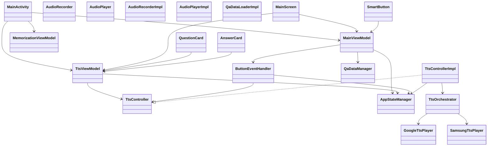
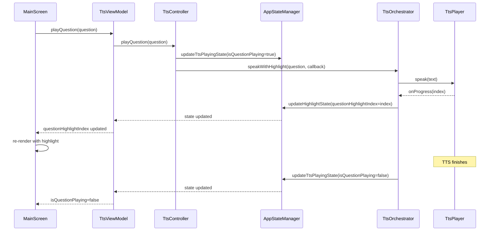
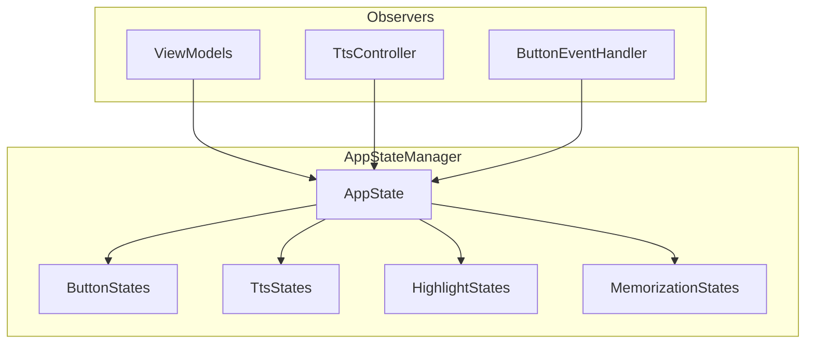

# OPicHelper 아키텍처 다이어그램

## 🏗️ **고수준 클래스 다이어그램**



## 🔄 **상태 관리 플로우 시퀀스 다이어그램**



## ⚠️ **현재 문제점 분석**

### **1. 상태 관리 분산**
- `TtsViewModel`에서 직접 `TtsOrchestrator` 사용 ❌
- `ButtonStateManager`에서 별도 상태 관리 ❌
- `TtsControllerImpl`에서 중복 상태 관리 ❌

### **2. 의존성 역전 원칙 위배**
- Presentation Layer가 Data Layer에 직접 의존 ❌
- Domain Layer 인터페이스 미사용 ❌

### **3. 테스트 어려움**
- 구체 클래스에 의존하여 Mock 테스트 어려움 ❌
- 상태 관리 복잡성으로 인한 테스트 복잡성 ❌

## ✅ **개선된 아키텍처 제안**

### **1. 단일 진실 소스 (Single Source of Truth)**


### **2. 의존성 역전 원칙 준수**
```mermaid
graph TB
    subgraph "Presentation Layer"
        VM[ViewModels]
    end
    
    subgraph "Domain Layer"
        TC[TtsController Interface]
        BE[ButtonEventHandler]
    end
    
    subgraph "Data Layer"
        TCI[TtsControllerImpl]
        TO[TtsOrchestrator]
    end
    
    VM --> TC
    BE --> TC
    TCI ..|> TC
    TCI --> TO
```

## 🚀 **리팩토링 로드맵**

### **Phase 1: 상태 관리 통합** ✅
- [x] `AppStateManager`를 단일 진실 소스로 설정
- [x] 모든 ViewModel이 `AppStateManager` 관찰
- [x] `TtsController`를 통한 TTS 제어

### **Phase 2: 의존성 정리**
- [x] `TtsViewModel`이 `TtsController` 인터페이스 사용
- [x] `ButtonEventHandler`가 `TtsController` 사용
- [ ] Use Case 패턴 도입

### **Phase 3: 테스트 개선**
- [ ] Mock 기반 단위 테스트 작성
- [ ] 상태 관리 테스트 작성
- [ ] 통합 테스트 작성

### **Phase 4: 성능 최적화**
- [ ] 불필요한 상태 업데이트 제거
- [ ] 메모리 누수 방지
- [ ] 백그라운드 처리 최적화 