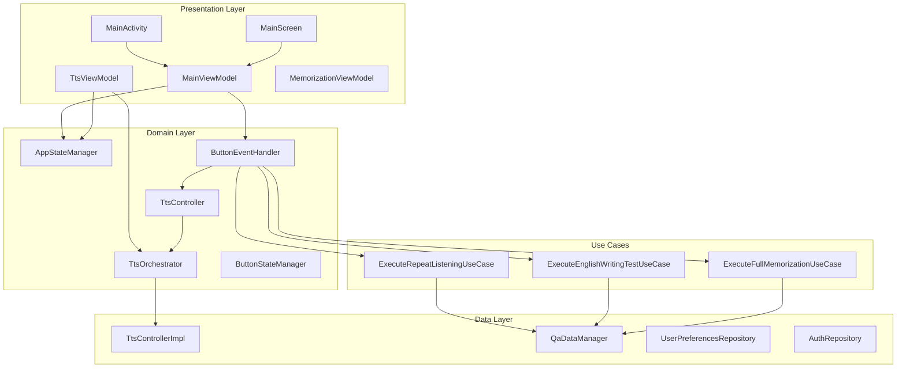
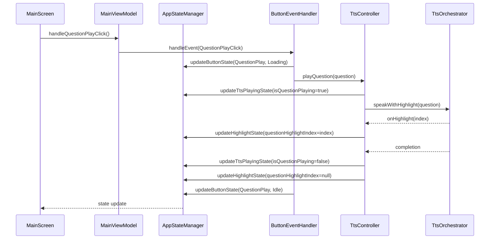
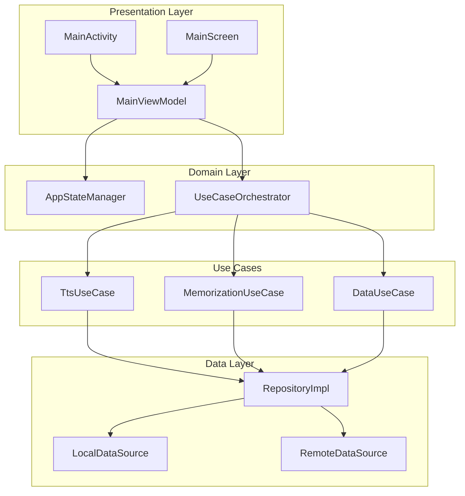

# OPicHelper 아키텍처 다이어그램

## 🏗️ 현재 아키텍처 분석

### 1. 하이레벨 클래스 다이어그램



### 2. 상태 관리 플로우



## 🚨 현재 문제점 분석

### 1. **상태 관리 분산**
- 여러 ViewModel에서 각각 상태 관리
- TtsController, ButtonStateManager 등에서 중복된 상태 관리
- 동기화 문제 발생 가능

### 2. **책임 분산**
- 하나의 기능이 여러 클래스에 분산
- TTS 관련 로직이 TtsController, TtsOrchestrator, TtsViewModel에 분산

### 3. **의존성 복잡성**
- 순환 의존성 가능성
- 너무 많은 의존성 주입

## 🔧 개선 제안

### 1. **상태 관리 통합**
```
AppStateManager (단일 진실 소스)
├── UI State
├── TTS State  
├── Button State
└── Business State
```

### 2. **계층별 책임 명확화**
```
Presentation Layer: UI 상태 관리
Domain Layer: 비즈니스 로직
Data Layer: 데이터 접근
```

### 3. **Use Case 중심 아키텍처**
```
Use Cases
├── TtsUseCase
├── MemorizationUseCase
└── DataUseCase
```

## 📊 개선된 아키텍처 제안



## 🎯 리팩토링 로드맵

### Phase 1: 상태 관리 통합 ✅ (완료)
- AppStateManager를 단일 진실 소스로 통합
- 중복된 상태 관리 제거

### Phase 2: Use Case 중심 리팩토링
- 비즈니스 로직을 Use Case로 분리
- ViewModel 간소화

### Phase 3: Repository 패턴 개선
- 데이터 접근 계층 정리
- 의존성 주입 단순화

### Phase 4: 테스트 가능성 개선
- 단위 테스트 추가
- 의존성 분리

## 📈 성과 지표

- **코드 복잡도**: 감소
- **테스트 커버리지**: 증가
- **유지보수성**: 향상
- **확장성**: 개선 