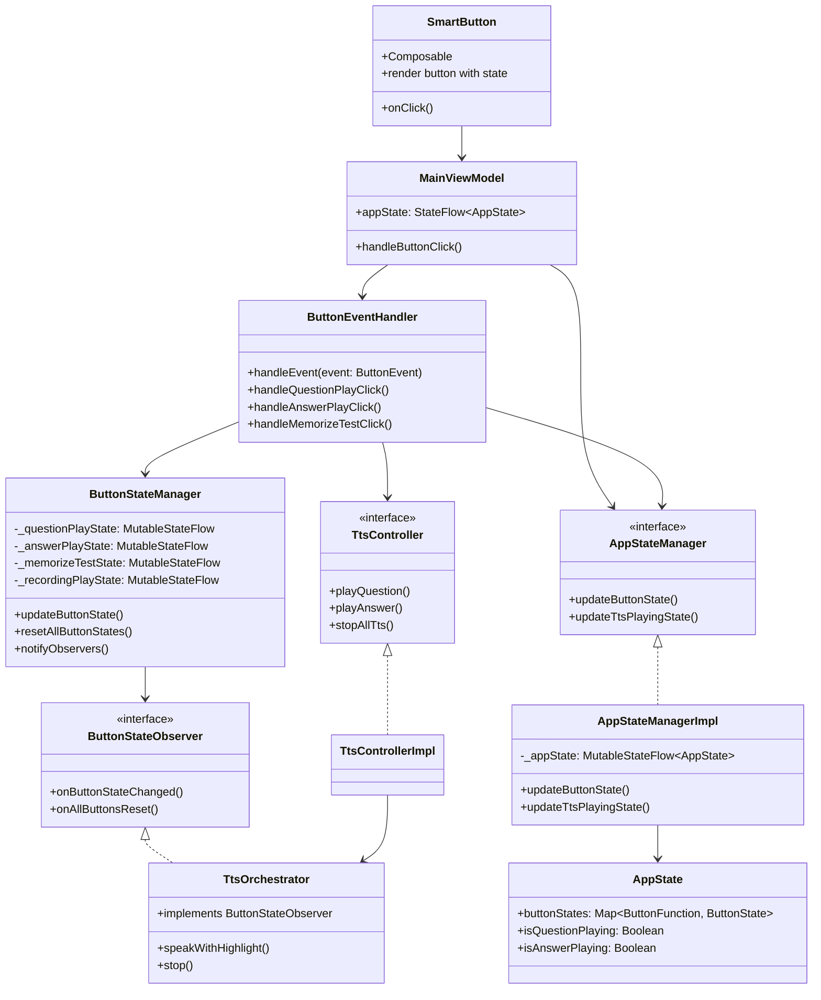
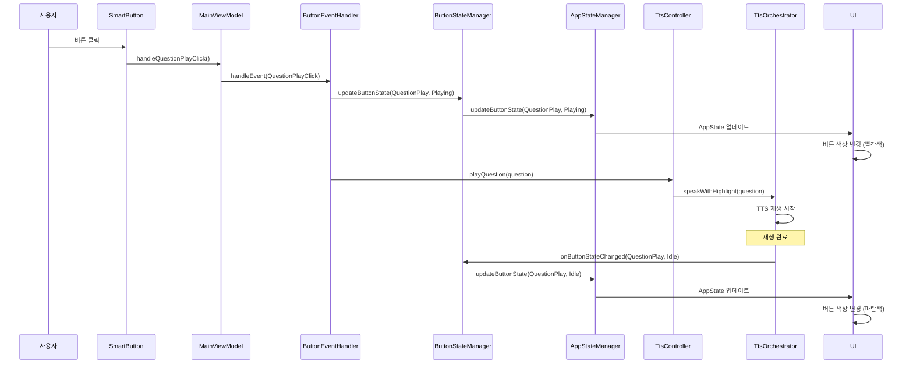
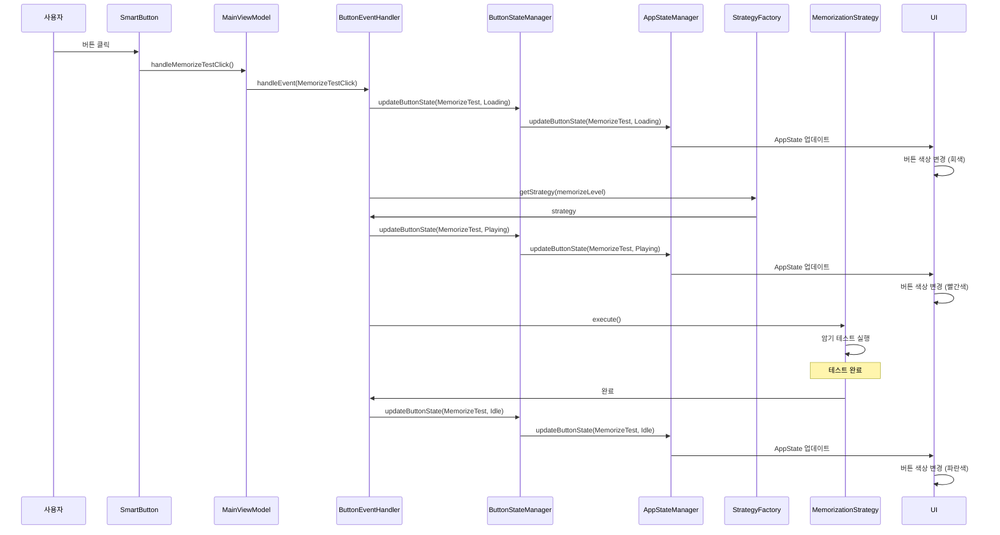
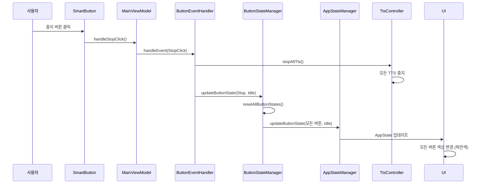

# 버튼 상태 변경 플로우

## 개요
버튼 클릭부터 상태 변경까지의 전체 플로우를 문서화합니다.

## 버튼 상태 정의

```kotlin
sealed class ButtonState {
    object Idle : ButtonState()      // 대기 상태
    object Loading : ButtonState()   // 로딩 상태
    object Playing : ButtonState()   // 재생 상태
    object Recording : ButtonState() // 녹음 상태
    object Paused : ButtonState()    // 일시정지 상태
    object Error : ButtonState()     // 오류 상태
}
```

## 클래스 다이어그램



## 시퀀스 다이어그램

### 1. 질문 재생 버튼 클릭 시퀀스



### 2. 암기 테스트 버튼 클릭 시퀀스



### 3. 중지 버튼 클릭 시퀀스



## 상태 전환 규칙

### 기본 상태 전환
```
Idle → Loading → Playing → Idle
Idle → Loading → Error → Idle
Playing → Paused → Playing
Playing → Idle (중지 시)
```

### 버튼별 상태 전환

#### 질문/답변 재생 버튼
```
Idle → Playing → Idle
```

#### 암기 테스트 버튼
```
Idle → Loading → Playing → Idle
```

#### 녹음 재생 버튼
```
Idle → Loading → Playing → Idle
```

#### 중지 버튼
```
모든 버튼 → Idle (한 번에)
```

## 버튼 색상 매핑

| 상태 | 색상 | 설명 |
|------|------|------|
| Idle | 파란색 (Primary) | 대기 상태 |
| Loading | 회색 (Secondary) | 로딩 중 |
| Playing | 빨간색 (Error) | 재생 중 |
| Recording | 주황색 | 녹음 중 |
| Paused | 노란색 | 일시정지 |
| Error | 빨간색 (Error) | 오류 상태 |

## 관찰자 패턴

### ButtonStateObserver 구현체
- **TtsOrchestrator**: 버튼 상태 변경 시 TTS 중지
- **기타 관찰자들**: 상태 변경 시 추가 작업 수행

### 알림 시점
1. **상태 변경 시**: `onButtonStateChanged(buttonFunction, newState)`
2. **전체 초기화 시**: `onAllButtonsReset()`

## 관련 파일들

### Presentation Layer
- `SmartButton.kt`: 버튼 UI 컴포넌트
- `MainViewModel.kt`: 버튼 클릭 이벤트 처리

### Domain Layer
- `ButtonEventHandler.kt`: 버튼 이벤트 처리 로직
- `ButtonStateManager.kt`: 버튼 상태 관리
- `ButtonStateObserver.kt`: 상태 변경 관찰자 인터페이스

### Data Layer
- `AppStateManager.kt`: 앱 상태 관리 인터페이스
- `AppStateManagerImpl.kt`: 앱 상태 관리 구현체
- `AppState.kt`: 앱 상태 데이터 클래스

### Infrastructure Layer
- `TtsController.kt`: TTS 제어 인터페이스
- `TtsOrchestrator.kt`: TTS 오케스트레이션 (ButtonStateObserver 구현) 