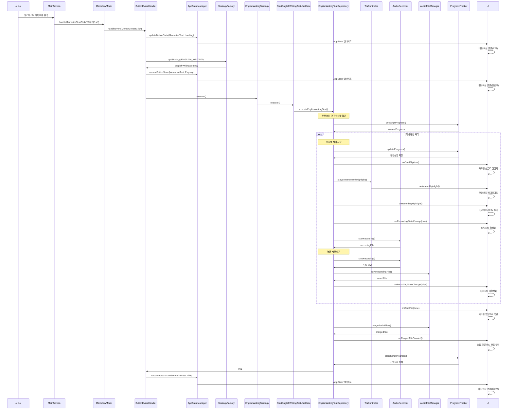
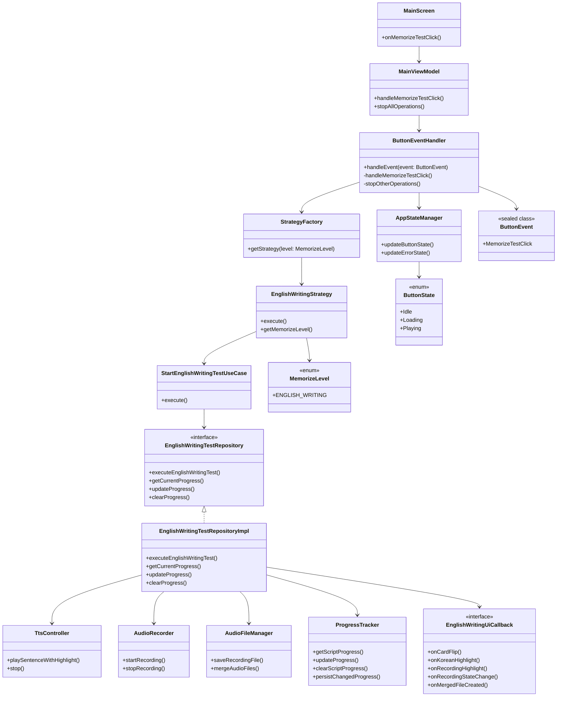

# 영작테스트 시작 버튼 클릭 시퀀스 플로우

## 1. 시퀀스 다이어그램

### 영작테스트 시작 버튼 클릭 시퀀스

## 2. 클래스 다이어그램

### 영작테스트 관련 클래스 구조

## 3. 주요 처리 단계

### 3.1 초기화 단계
1. **사용자 액션**: 암기테스트 시작 버튼 클릭
2. **이벤트 처리**: MainViewModel에서 ButtonEventHandler로 이벤트 전달
3. **상태 변경**: 버튼 상태를 Loading → Playing으로 변경

### 3.2 전략 실행 단계
1. **전략 선택**: StrategyFactory에서 EnglishWritingStrategy 가져오기
2. **UseCase 실행**: StartEnglishWritingTestUseCase 실행
3. **Repository 호출**: EnglishWritingTestRepositoryImpl 실행

### 3.3 문장별 처리 단계
1. **진행상황 확인**: 이전 진행상황이 있는지 확인
2. **카드 뒤집기**: 한글 문장으로 카드 뒤집기
3. **TTS 재생**: 한글 문장 TTS 재생 (하이라이트 포함)
4. **녹음 시작**: 사용자 녹음 시작
5. **녹음 완료**: 녹음 파일 저장
6. **상태 업데이트**: 진행상황 실시간 저장

### 3.4 완료 단계
1. **카드 복원**: 영문으로 카드 복원
2. **파일 병합**: 모든 녹음 파일을 하나로 병합
3. **진행상황 정리**: 완료된 진행상황 삭제
4. **상태 복원**: 버튼 상태를 Idle로 복원

## 4. 핵심 컴포넌트 역할

### 4.1 Presentation Layer
- **MainScreen**: 사용자 인터페이스 제공
- **MainViewModel**: UI 상태 관리 및 이벤트 처리
- **ButtonEventHandler**: 버튼 이벤트 처리 로직

### 4.2 Domain Layer
- **EnglishWritingStrategy**: 영작테스트 전략 구현
- **StartEnglishWritingTestUseCase**: 영작테스트 비즈니스 로직
- **EnglishWritingUiCallback**: UI 콜백 인터페이스

### 4.3 Data Layer
- **EnglishWritingTestRepositoryImpl**: 실제 영작테스트 실행
- **TtsController**: TTS 재생 관리
- **AudioRecorder**: 오디오 녹음 관리
- **AudioFileManager**: 오디오 파일 관리
- **ProgressTracker**: 진행상황 추적

## 5. 에러 처리 및 예외 상황

### 5.1 코루틴 취소 처리
- 각 단계에서 `isActive` 체크
- 취소 시 적절한 정리 작업 수행

### 5.2 파일 처리 예외
- 녹음 파일 저장 실패 시 처리
- 병합 파일 생성 실패 시 처리

### 5.3 진행상황 복구
- 앱 재시작 시 이전 진행상황 복구
- 중단된 테스트 재개 가능 