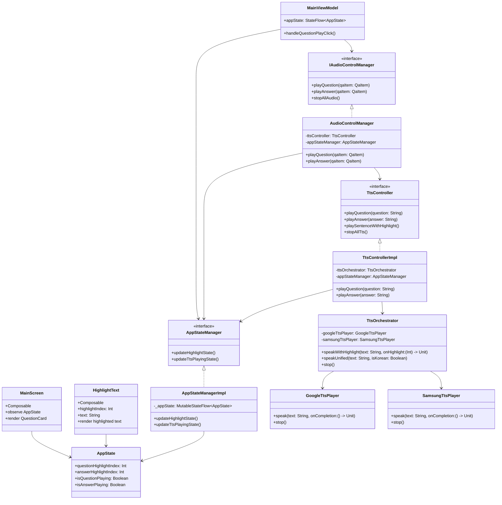
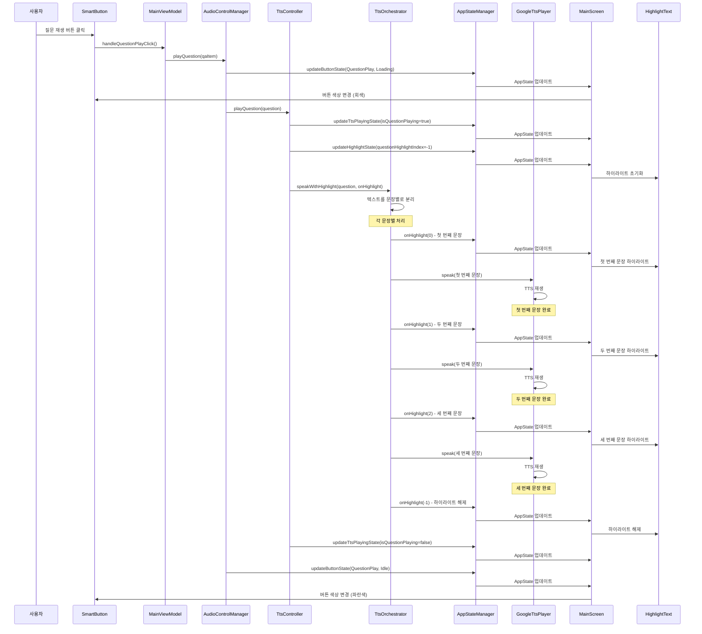

# 질문 재생 시퀀스 플로우

## 개요
질문 재생 버튼 클릭부터 TTS 재생 완료까지의 전체 플로우를 문서화합니다.

## 클래스 다이어그램



## 시퀀스 다이어그램



## 플로우 다이어그램

```
사용자 클릭 → MainViewModel → AudioControlManager → TtsController → TtsOrchestrator → TTS Player → UI 업데이트
```

## 상세 시퀀스

### 1. 사용자 인터랙션
```
SmartButton 클릭 → MainViewModel.handleQuestionPlayClick()
```

### 2. MainViewModel 처리
```
MainViewModel.handleQuestionPlayClick()
├── 현재 QA 아이템 가져오기
├── AudioControlManager.playQuestion() 호출
└── 버튼 상태 업데이트
```

### 3. AudioControlManager 처리
```
AudioControlManager.playQuestion()
├── 기존 재생 중지
├── TtsController.playQuestion() 호출
├── 재생 상태 업데이트 (isQuestionPlaying = true)
└── 버튼 상태 업데이트 (Loading → Playing)
```

### 4. TtsController 처리
```
TtsControllerImpl.playQuestion()
├── AppState 업데이트 (TTS 재생 상태)
├── 하이라이트 초기화 (questionHighlightIndex = -1)
├── TtsOrchestrator.speakWithHighlight() 호출
├── 하이라이트 콜백 처리
└── 재생 완료 시 상태 정리
```

### 5. TtsOrchestrator 처리
```
TtsOrchestrator.speakWithHighlight()
├── 텍스트를 문장별로 분리
├── 하이라이트 초기화 (onHighlight(-1))
├── 각 문장별 처리:
│   ├── 하이라이트 설정 (onHighlight(idx))
│   ├── 언어 감지 (한글/영문)
│   ├── 적절한 TTS 플레이어 선택
│   ├── TTS 재생
│   └── 문장 간 딜레이
└── 하이라이트 해제 (onHighlight(-1))
```

### 6. TTS Player 처리
```
GoogleTtsPlayer/SamsungTtsPlayer
├── TTS 엔진 초기화
├── 텍스트를 음성으로 변환
├── 재생 시작
└── 재생 완료 콜백 호출
```

### 7. UI 업데이트
```
AppState 변경 → MainScreen 재구성 → HighlightText 렌더링
├── AppState.questionHighlightIndex 변경 감지
├── QuestionCard 재렌더링
├── HighlightText 컴포넌트 업데이트
└── 하이라이트 표시
```

## 현재 상태 (수정 완료)

### ✅ 해결된 문제점
1. **하이라이트 기능 통합**: 모든 TTS 재생에서 하이라이트가 작동
2. **일관된 아키텍처**: TtsController를 통한 단일 진입점
3. **코드 정리**: 중복된 TTS 호출 로직 제거

### 🔧 주요 수정사항
1. **AudioControlManager**: TtsOrchestrator → TtsController 변경
2. **MemorizationViewModel**: TtsOrchestrator → TtsController 변경  
3. **ButtonActionHandler**: TtsOrchestrator → TtsController 변경
4. **Repository들**: TtsOrchestrator → TtsController 변경
5. **AppModule**: 의존성 주입 설정 수정

## 예상 로그 시퀀스 (수정 후)

```
1. SmartButton clicked: QuestionPlay
2. MainViewModel: 질문 재생 버튼 클릭
3. AudioControlManager: 질문 재생 시작
4. TtsControllerImpl: 질문 TTS 재생 시작
5. TtsOrchestrator: 🎯 speakWithHighlight 호출됨
6. TtsOrchestrator: 📝 문장 분리 완료: 2개 문장
7. TtsOrchestrator: ✨ 하이라이트 설정: 문장 0
8. AppStateManager: 하이라이트 상태 업데이트: question=0
9. MainScreen: 질문 카드 하이라이트 상태 업데이트
10. HighlightText: 문장 0: isHighlighted=true
11. GoogleTtsPlayer: Google TTS 재생
12. TtsOrchestrator: ✨ 하이라이트 설정: 문장 1
13. AppStateManager: 하이라이트 상태 업데이트: question=1
14. GoogleTtsPlayer: Google TTS 재생 완료
15. TtsOrchestrator: ✅ speakWithHighlight 완료
16. AppStateManager: 하이라이트 상태 업데이트: question=-1
```

## 테스트 방법

1. **로그 확인**: `speakWithHighlight` 로그가 나타나는지 확인
2. **하이라이트 상태**: `questionHighlightIndex`가 0, 1, -1 순서로 변경되는지 확인
3. **UI 업데이트**: 실제 화면에서 하이라이트가 표시되는지 확인

## 관련 파일들

### Presentation Layer
- `MainViewModel.kt`: 사용자 인터랙션 처리
- `MainScreen.kt`: UI 렌더링
- `HighlightText.kt`: 하이라이트 표시 컴포넌트

### Domain Layer
- `IAudioControlManager.kt`: 오디오 제어 인터페이스
- `AudioControlManager.kt`: 오디오 제어 로직
- `TtsController.kt`: TTS 제어 인터페이스

### Data Layer
- `TtsControllerImpl.kt`: TTS 재생 및 하이라이트 처리
- `AppStateManager.kt`: 상태 관리 인터페이스
- `AppStateManagerImpl.kt`: 하이라이트 상태 관리
- `AppState.kt`: 애플리케이션 상태 데이터 클래스

### Infrastructure Layer
- `TtsOrchestrator.kt`: 문장별 하이라이트 TTS 재생
- `GoogleTtsPlayer.kt`: Google TTS 플레이어
- `SamsungTtsPlayer.kt`: Samsung TTS 플레이어 