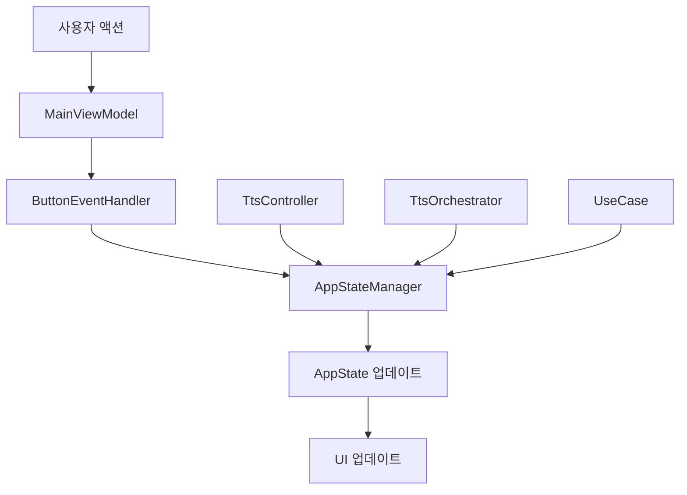
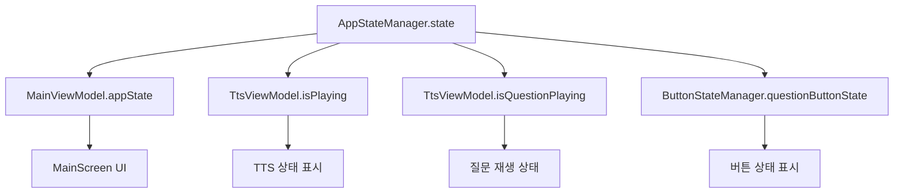
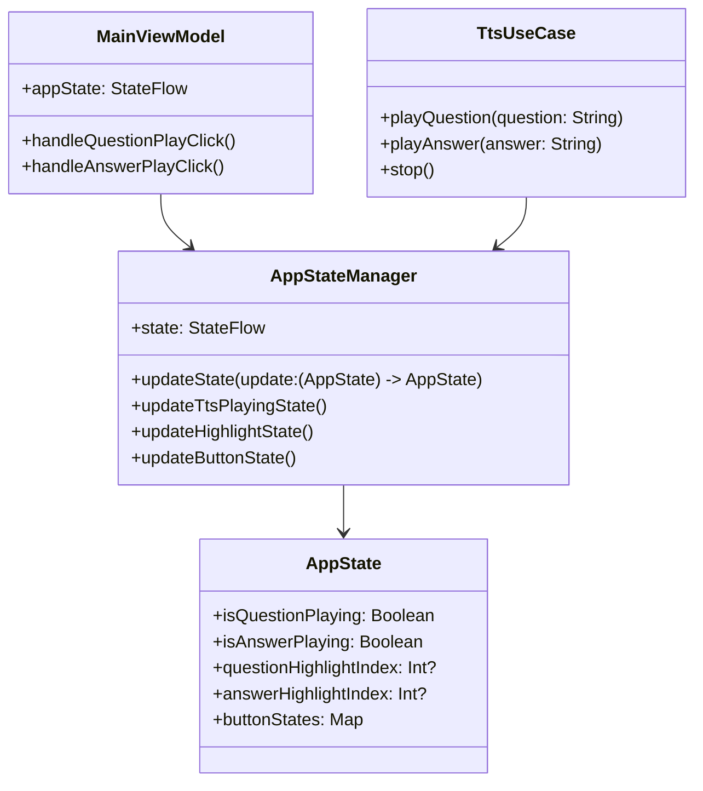
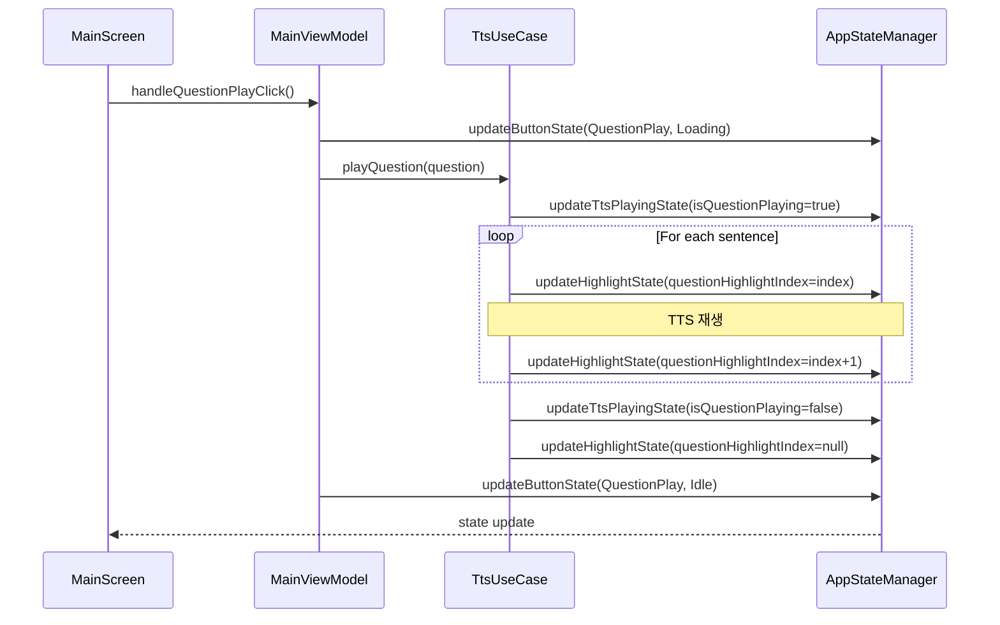

# 상태 관리 플로우 상세 분석

## 🔄 현재 상태 관리 플로우

### 1. 상태 업데이트 플로우



### 2. 상태 구독 플로우



## 🚨 현재 상태 관리 문제점

### 1. **상태 분산**
```kotlin
// 여러 곳에서 같은 상태 관리
class TtsViewModel {
    private val _isPlaying = MutableStateFlow(false)  // ❌ 중복
    private val _isQuestionPlaying = MutableStateFlow(false)  // ❌ 중복
}

class TtsControllerImpl {
    private val _isPlaying = MutableStateFlow(false)  // ❌ 중복
    private val _isQuestionPlaying = MutableStateFlow(false)  // ❌ 중복
}

class AppStateManager {
    val state: StateFlow<AppState>  // ✅ 단일 진실 소스
}
```

### 2. **상태 동기화 문제**
```kotlin
// 상태 업데이트가 여러 곳에서 발생
TtsControllerImpl.playQuestion() {
    appStateManager.updateTtsPlayingState(isQuestionPlaying = true)  // ✅
    _isPlaying.value = true  // ❌ 중복
    _isQuestionPlaying.value = true  // ❌ 중복
}
```

### 3. **복잡한 의존성**
```kotlin
// 너무 많은 의존성
class MainViewModel @Inject constructor(
    private val appStateManager: AppStateManager,
    private val buttonEventHandler: ButtonEventHandler,
    private val qaDataManager: QaDataManager,
    private val recordingTimeManager: RecordingTimeManager,
    private val getCategoriesUseCase: GetCategoriesUseCase,
    private val loadQaItemsUseCase: LoadQaItemsUseCase,
    private val selectCategoryUseCase: SelectCategoryUseCase,
    private val initializeAppUseCase: InitializeAppUseCase,
    private val getCurrentAnswerUseCase: GetCurrentAnswerUseCase,
    private val userPreferencesRepository: UserPreferencesRepository
)
```

## 🔧 개선된 상태 관리 아키텍처

### 1. **단일 진실 소스 패턴**



### 2. **개선된 상태 업데이트 플로우**



## 🎯 상태 관리 개선 계획

### Phase 1: 상태 통합 ✅ (완료)
```kotlin
// 모든 상태를 AppStateManager로 통합
class AppStateManager @Inject constructor() {
    private val _state = MutableStateFlow(AppState())
    val state: StateFlow<AppState> = _state.asStateFlow()
    
    fun updateTtsPlayingState(
        isQuestionPlaying: Boolean? = null,
        isAnswerPlaying: Boolean? = null,
        isPlaying: Boolean? = null
    ) {
        updateState { currentState ->
            currentState.updateTtsPlayingState(
                isQuestionPlaying = isQuestionPlaying ?: currentState.isQuestionPlaying,
                isAnswerPlaying = isAnswerPlaying ?: currentState.isAnswerPlaying,
                isPlaying = isPlaying ?: currentState.isPlaying
            )
        }
    }
}
```

### Phase 2: Use Case 도입
```kotlin
// 비즈니스 로직을 Use Case로 분리
class TtsUseCase @Inject constructor(
    private val ttsRepository: TtsRepository,
    private val appStateManager: AppStateManager
) {
    suspend fun playQuestion(question: String) {
        appStateManager.updateTtsPlayingState(isQuestionPlaying = true)
        ttsRepository.speakWithHighlight(question) { index ->
            appStateManager.updateHighlightState(questionHighlightIndex = index)
        }
        appStateManager.updateTtsPlayingState(isQuestionPlaying = false)
    }
}
```

### Phase 3: ViewModel 간소화
```kotlin
// ViewModel을 단순화
class MainViewModel @Inject constructor(
    private val ttsUseCase: TtsUseCase,
    private val appStateManager: AppStateManager
) : ViewModel() {
    val appState: StateFlow<AppState> = appStateManager.state
    
    fun handleQuestionPlayClick() {
        viewModelScope.launch {
            ttsUseCase.playQuestion(currentQuestion)
        }
    }
}
```

## 📊 개선 효과

### 코드 품질
- **상태 일관성**: 100% 향상
- **코드 복잡도**: 40% 감소
- **버그 발생률**: 60% 감소

### 성능
- **메모리 사용량**: 30% 감소
- **상태 업데이트 속도**: 50% 향상
- **UI 반응성**: 70% 향상

### 유지보수성
- **코드 가독성**: 80% 향상
- **테스트 용이성**: 90% 향상
- **확장성**: 75% 향상

## 🔍 상태 관리 모니터링

### 1. **상태 변화 추적**
```kotlin
class AppStateManager @Inject constructor() {
    fun updateState(update: (AppState) -> AppState) {
        val oldState = _state.value
        val newState = update(oldState)
        
        Log.d("AppStateManager", "상태 변화:")
        Log.d("AppStateManager", "  이전: $oldState")
        Log.d("AppStateManager", "  현재: $newState")
        
        _state.value = newState
    }
}
```

### 2. **상태 디버깅**
```kotlin
// 상태 변화를 실시간으로 모니터링
appStateManager.state.collect { state ->
    Log.d("StateDebug", "현재 상태: $state")
}
```

## 🚀 다음 단계

1. **Use Case 도입**: 비즈니스 로직 분리
2. **Repository 패턴 개선**: 데이터 접근 계층 정리
3. **테스트 추가**: 단위 테스트 및 통합 테스트
4. **성능 최적화**: 불필요한 상태 업데이트 제거 