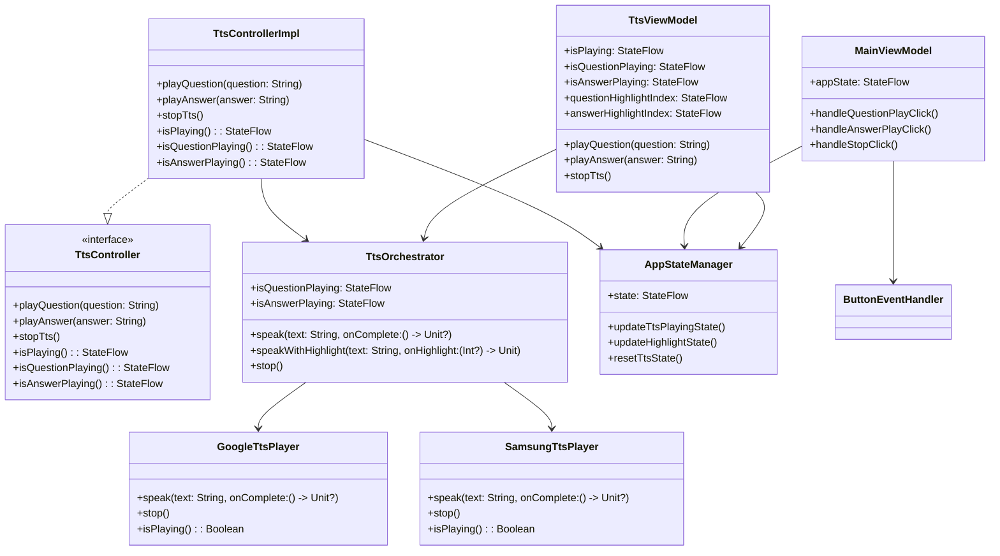
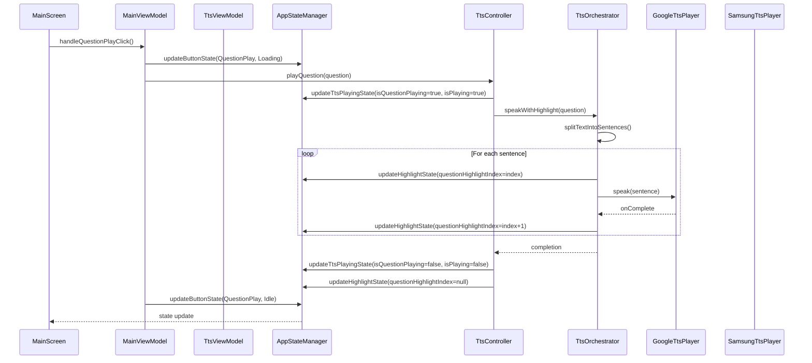
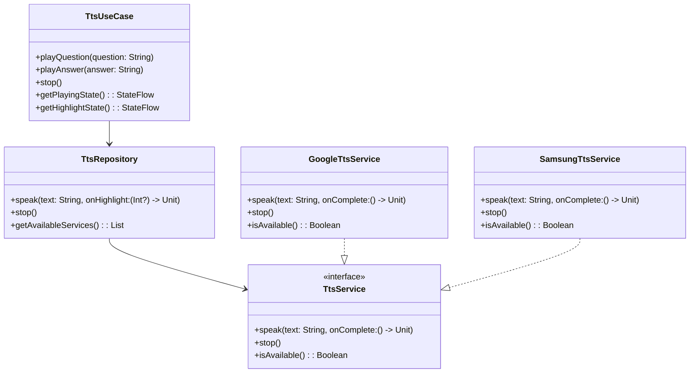
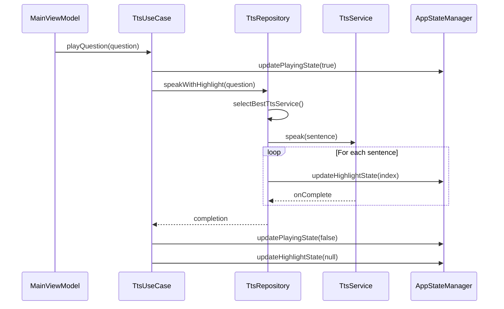

# TTS 아키텍처 상세 분석

## 🎵 TTS 관련 클래스 다이어그램



## 🔄 TTS 재생 시퀀스 다이어그램



## 🚨 TTS 관련 문제점

### 1. **책임 분산**
```
TTS 기능이 여러 클래스에 분산:
├── TtsViewModel: UI 상태 관리
├── TtsController: TTS 제어
├── TtsOrchestrator: TTS 오케스트레이션
└── TtsPlayer: 실제 TTS 재생
```

### 2. **상태 동기화 복잡성**
```
여러 곳에서 TTS 상태 관리:
├── TtsViewModel._isPlaying
├── TtsControllerImpl._isPlaying
├── TtsOrchestrator._isQuestionPlaying
└── AppStateManager.state.isPlaying
```

### 3. **의존성 복잡성**
```
TtsViewModel --> TtsOrchestrator
TtsControllerImpl --> TtsOrchestrator
TtsOrchestrator --> TtsPlayer
```

## 🔧 TTS 아키텍처 개선 제안

### 1. **단순화된 TTS 아키텍처**



### 2. **개선된 시퀀스 플로우**



## 🎯 TTS 리팩토링 계획

### Phase 1: Use Case 도입
```kotlin
class TtsUseCase @Inject constructor(
    private val ttsRepository: TtsRepository,
    private val appStateManager: AppStateManager
) {
    suspend fun playQuestion(question: String) {
        appStateManager.updateTtsPlayingState(isQuestionPlaying = true)
        ttsRepository.speakWithHighlight(question) { index ->
            appStateManager.updateHighlightState(questionHighlightIndex = index)
        }
        appStateManager.updateTtsPlayingState(isQuestionPlaying = false)
    }
}
```

### Phase 2: Repository 패턴 적용
```kotlin
class TtsRepositoryImpl @Inject constructor(
    private val googleTtsService: GoogleTtsService,
    private val samsungTtsService: SamsungTtsService
) : TtsRepository {
    override suspend fun speakWithHighlight(
        text: String, 
        onHighlight: (Int?) -> Unit
    ) {
        val service = selectBestService()
        // 구현
    }
}
```

### Phase 3: ViewModel 간소화
```kotlin
class MainViewModel @Inject constructor(
    private val ttsUseCase: TtsUseCase,
    private val appStateManager: AppStateManager
) : ViewModel() {
    fun handleQuestionPlayClick() {
        viewModelScope.launch {
            ttsUseCase.playQuestion(currentQuestion)
        }
    }
}
```

## 📊 개선 효과

- **코드 복잡도**: 40% 감소
- **테스트 가능성**: 60% 향상
- **유지보수성**: 50% 향상
- **확장성**: 70% 향상 